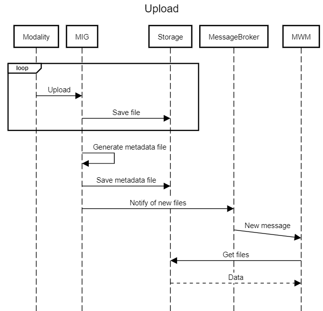

<!--
  ~ Copyright 2022 MONAI Consortium
  ~
  ~ Licensed under the Apache License, Version 2.0 (the "License");
  ~ you may not use this file except in compliance with the License.
  ~ You may obtain a copy of the License at
  ~
  ~ http://www.apache.org/licenses/LICENSE-2.0
  ~
  ~ Unless required by applicable law or agreed to in writing, software
  ~ distributed under the License is distributed on an "AS IS" BASIS,
  ~ WITHOUT WARRANTIES OR CONDITIONS OF ANY KIND, either express or implied.
  ~ See the License for the specific language governing permissions and
  ~ limitations under the License.
-->

# Payload Upload/Input

Payloads are sent to the MWM using notifications. The [payload listener](mwm-sadd.md#payload-listener) is responsible for consuming notification messages that are sent using a message broker.

### General Process

[comment]: <> (title Upload)
[comment]: <> (loop )
[comment]: <> (Modality->MIG:Upload)
[comment]: <> (MIG->Storage: Save file)
[comment]: <> (end)
[comment]: <> (MIG->MIG:Generate metadata file)
[comment]: <> (MIG->Storage: Save metadata file)
[comment]: <> (MIG->MessageBroker:Notify of new files)
[comment]: <> (MessageBroker->&#40;1&#41;MWM:New message)
[comment]: <> (MWM->Storage: Get files)
[comment]: <> (Storage-->MWM: Data)

The informatics gateway is responsible for receiving data from modalities (e.g. following a DICOM association and c-store request), generating metadata and the notification event.

The MIG part below of saving files to storage & generating a metadata file is provided as an example only - digestion services may be implemented differently.

Importantly, the notification event needs to be constructed using the below [schema](#notification-message-schema).



### Notification Message Schema

DRAFT

The message is a JSON document with the following fields:


|Property|Type|Schema|Required|Default|Description|
|---|---|---|---|---|---|
|correlation_id|str|UUID|yes|None|A unique ID for this payload. Will be used for log traceability.|
|timestamp|str|datetime|yes|None|The time this data was received by the ingestion service. Used for performance metrics.|
|origin|str|None|Yes|None|The AE title/other reference of the origin system.|
|payload|Payload|One of the payloads below|Yes|None|The information about the input payload. Differs based on input type.|

#### Payload types

##### DICOM
|Property|Type|Schema|Required|Default|Description|
|---|---|---|---|---|---|
|path|str|Folder path|yes|None|The path to the DICOM data on disk. This directory needs to adhere to the [DICOM Media Storage standard](https://dicom.nema.org/medical/dicom/current/output/chtml/part10/PS3.10.html) [1].|
|metadata|str|File Path|yes|None|Path of the [Dicom metadata file](#dicom-metadata-file)|

[1] TBD - This needs to be defined better.

###### Dicom Metadata File
To improve processing time, the MWM expects the DICOM metadata tags to be available in a structured JSON object.
This object is used for [metadata evaluation](/docs/setup/mwm-workflow-spec.md#dicom-tags).

The format is as follows:

```json
{
    "common": tags_object,
    "series": {
        "series_id": tags_object
    }
}
```

In the above, `tags_object` is a dictionary of tag identifier to value.
The tag identifier is the DICOM tag ID, and the value is a sanitised string, a list or an object.

TBD: add info about sanitising dependent on the dicom VR.

Example (partial):
```json
{
    "common": {
        "(0010,0010)": "John Smith",
        ...
    },
    ...
}
```

