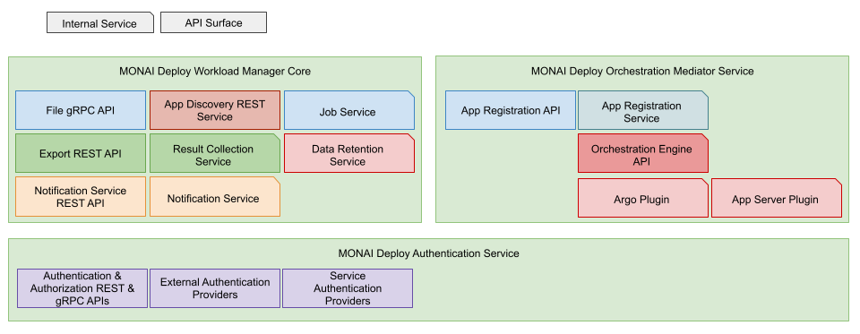
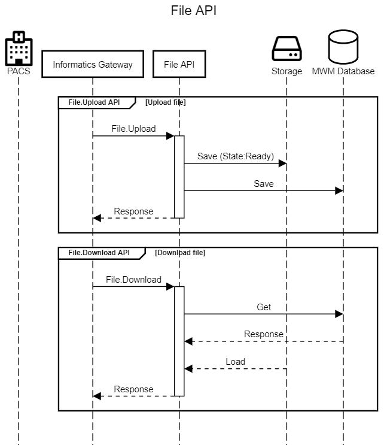
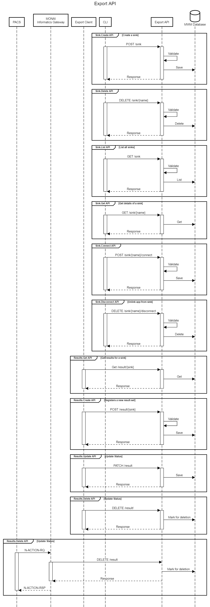
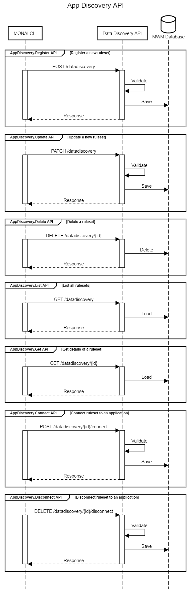
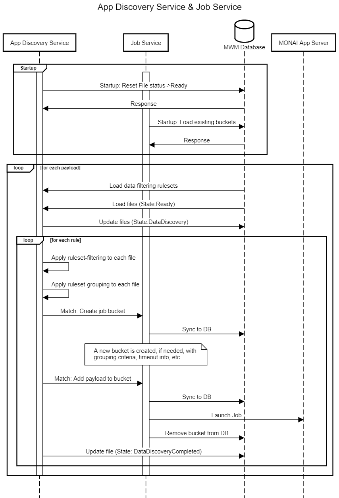
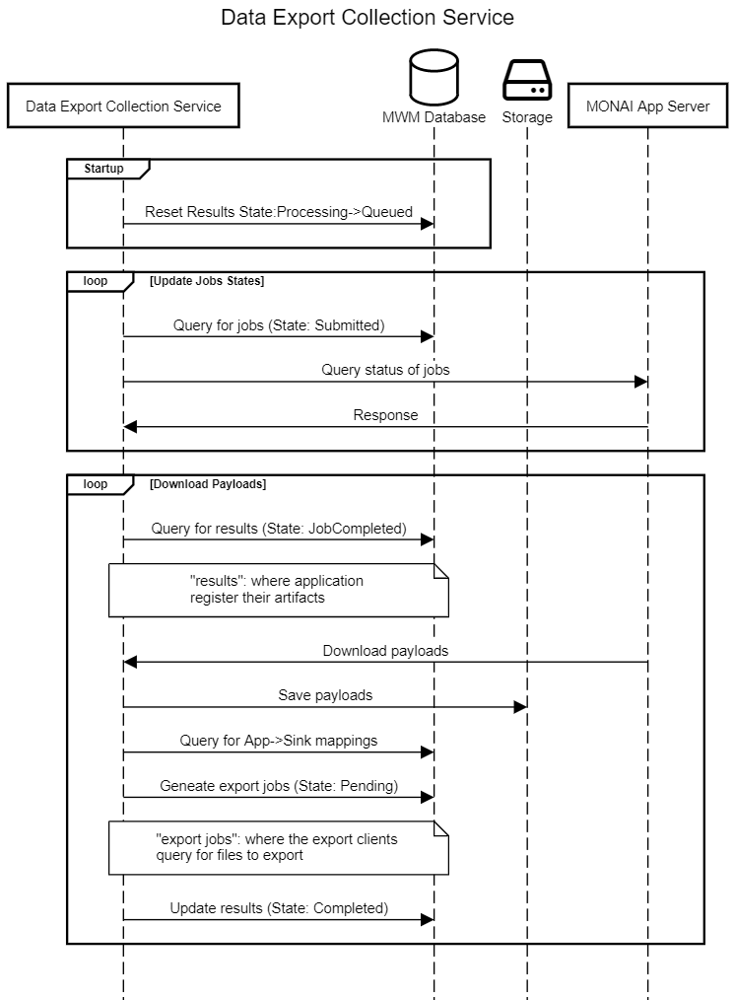

# MONAI Deploy Workload Manager Software Architecture & Design


## Overview

The MONAI Deploy Workload Manager (MWM) is the central hub for the MONAI Deploy platform. It routes received medical data from MONAI Informatics Gateway (or your custom ingestion service) to MONAI applications based on user-defined rulesets using the App Discovery Service. It is also responsible for monitoring application execution statuses and routing any results produced by the applications back to the configured destinations.

## Purpose

This document describes the detailed designs derived from the requirements defined in MONAI Deploy Workload Manager Requirements.

## Scope

The scope of this document is limited to the design of the MONAI Deploy Workload Manager. Therefore, this design document does not address any design decisions belonging to other subsystems, such as MONAI Informatics Gateway, MONAI Deploy Application SDK.

## Assumptions, Constraints, Dependencies

## Definitions, Acronyms, Abbreviations

| Term        | Definition                                                                                                                                                       |
| ----------- | ---------------------------------------------------------------------------------------------------------------------------------------------------------------- |
| Export Sink | An export sink is a user-configured sink where the results (application-generated artifacts) are assigned to and later picked up by the export service clients. |
| MWM         | MONAI Deploy Workload Manager                                                                                                                                           |
| MIG         | MONAI Informatics Gateway                                                                                                                                        |

## Reference Documents

- [MONAI Deploy Workload Manager Requirements](mwm-srs.md)

## Architecture Details

MONAI Deploy Workload Manager is divided into three separate services where each includes a set of services and APIs to interconnect other subsystems in MONAI Deploy. Every service in the MWM runs on one or more threads that may receive requests from external systems/services. It also interacts with a database and other external services, such as the App Server or Argo, for job management.

---

### MONAI Deploy Workload Manager Core Service

### API Surface Area

- **MWM CLI**: A CLI (command-line interface) for interacting with the APIs provided.
- **File API**: A set of APIs for uploading/downloading files to/from user-deployed applications.
- **Export API**: A set of APIs to create export sinks, connect applications to export sinks, and register results.
- **Notification Service API**: For subscribing/unsubscribing to MWM events.

### Internal Services

- **App Discovery Service**: A service responsible for applying user-defined data filtering rules to received datasets. Results of each ruleset get recorded for the Job Service.
- **Job Service**: A service that dispatches and records jobs sent to the orchestration engines and monitors job state and status.
- **Notification Service**: Notifies subscribed external entities of the system status and jobs' statuses.
- **Data Retention Service**: Monitors storage usages, apply data retention policies, and cleans up storage.
- **Result Collection Service**: A service responsible for retrieving results from orchestration engines and distributing them to all configured export sinks.
---

### MONAI Deploy Orchestration Mediator Service

### API Surface Area

- **App Registration API**: APIs to register MONAI Deploy applications.
### Internal Services

- **App Registration Service**: A service responsible for scanning MONAI App Server and other supported orchestration engines for deployed MONAI Deploy applications.

---

### MONAI Deploy Authentication Service

### API Surface Area

- **Authentication API**: Provides authentication/authorization to connected clients, such as the Informatics Gateway and other export service clients.


---

### Design



---

#### MWM CLI

The MONAI Deploy Workload Manager provides the following CLI tools to configure and connect components in the MONAI Deploy platform:

#### Apps Registration API

- `mwm apps list...`: list all applications registered with the configured orchestration engines.
- `mwm apps add ...`: register a new application

#### Data Filtering Rule

- `mwm rules add...`: add a new app discovery ruleset
- `mwm rules remove...`: delete an existing app discovery ruleset
- `mwm rules update...`: update/replace an existing app discovery ruleset
- `mwm rules list...`: list all installed app discovery ruleset
- `mwm rules connect...`: connect an existing app discovery ruleset to an application
- `mwm rules disconnect...`: disconnect an application from an app discovery ruleset

---

#### Export Sink

- `mwm sink add...`: create a new sink for export
- `mwm sink remove...`: delete an existing sink
- `mwm sink list...`: list all configured sink
- `mwm sink connect...`: connect a sink to an application
- `mwm sink disconnect...`: disconnect a sink to an application

---

#### Authentication API

_TBD_

---

#### File API



The File API allows clients, e.g., the Informatics Gateway, to upload and download files.

##### File.Upload API

Uploads artifact/file.
Each uploaded file object must contain:

- Date & time received
- A UUID that is to correlate the connection info. E.g., the MONAI Deploy Informatics Gateway includes the UUID generated when the DICOM association request is received.
- Source of the file.  E.g. The MONAI Deploy Informatics Gateway uses the called AE Title as the source.
- (Optional) The application ID or name to associate the data to. If specified, the file bypasses the filtering stage of the App Discovery Service.

##### File.Download API

Downloads artifact/file for export service clients.

##### File States

- `Ready`: file is received and stored.
- `DataDiscovery`: file is being processed by the App Discovery Service.
- `DataDiscoveryCompleted`: file has been processed by the App Discovery Service.

#### Export API



The Export API provides functionalities to create sinks and connect/disconnect sinks to applications. These connections enables MWM to route application generated results to one or more external applications or services.

##### POST /sink API

Creates a new sink to enable the Result Collection Service to distribute application generated results and for the export clients to query matching export tasks.

Note: sinks with the same `name` are allowed so different arguments may be provided to the designated sinks.

###### URL

`/sink`

###### Method

`POST`

###### Data Params

```json
{
  "name": "dicom",
  "extensions": [".dcm"],
  "args": {
    "destination": "MySCU"
  }
}
```

#### Success Response

- Code: `201`: Sink created successfully.

  Content: `{"name": "dicom", "extensions": ["dcm"], "args": { "destination": "MySCU" } }`

- Code: `400`: Validation error.

  Content: A [Problem details](https://datatracker.ietf.org/doc/html/rfc7807) object with validation error details.

- Code: `500`: Server error.

  Content: A [Problem details](https://datatracker.ietf.org/doc/html/rfc7807) object with server error details.

##### DELETE /sink/{name} API

Deletes a sink. Warning: Remove all linked applications prior to deleting a sink.

###### URL

`/sink/{name}`

###### Method

`DELETE`

###### Data Params

N/A

#### Success Response

- Code: `202`: Sink deleted successfully.

  Content: N/A

- Code: `404`: Sink cannot be found.

  Content: N/A

- Code: `500`: Server error.

  Content: A [Problem details](https://datatracker.ietf.org/doc/html/rfc7807) object with server error details.

##### GET /sink API

List all sinks configured on MWM.

###### URL

`/sink`

###### Method

`GET`

###### Data Params

N/A

#### Success Response

- Code: `200`: All sinks returned successfully.

  Content:

  ```json
  ["dicom-xray-room", "fhir-east-us", "appsink"]
  ```

- Code: `500`: Server error.

  Content: A [Problem details](https://datatracker.ietf.org/doc/html/rfc7807) object with server error details.

##### GET /sink/{name} API

Gets details of a sink.

###### URL

`/sink/{name}`

###### Method

`GET`

###### Data Params

N/A

#### Success Response

- Code: `200`: Sink returned successfully.

  Content:

  ```json
  {
    "name": "dicom",
    "extensions": ["dcm"],
    "args": { "aetitle": "PACS1" },
    "apps": ["82582ed7-20a2-4140-9c91-d416267b2cbf"]
  }
  ```

- Code: `404`: Sink cannot be found.

  Content: N/A

- Code: `500`: Server error.

  Content: A [Problem details](https://datatracker.ietf.org/doc/html/rfc7807) object with server error details.

##### POST /sink/{name}/connect API

Connects an application to the sink.

###### URL

`/sink/{name}/connect`

###### Method

`POST`

###### Data Params

```json
{
  "application": "8ba92f06-215a-474f-a093-d8647f76f561"
}
```

#### Success Response

- Code: `201`: Sink updated successfully.

  Content:

  ```json
  {
    "name": "fhir",
    "extensions": ["json", "xml"],
    "args": { "endpoint": "FHIRSERVER1" },
    "apps": ["b1fc9ab4-428b-44e4-8365-4791fb54d773"]
  }
  ```

- Code: `404`: Sink or application cannot be found.

  Content: A [Problem details](https://datatracker.ietf.org/doc/html/rfc7807) object with error details.

- Code: `500`: Server error.

  Content: A [Problem details](https://datatracker.ietf.org/doc/html/rfc7807) object with server error details.

##### DELETE /sink/{name}/disconnect API

Disconnect an application from the specified sink.

###### URL

`/sink/{name}/disconnect`

###### Method

`DELETE`

###### Data Params

```json
{
  "application": "8ba92f06-215a-474f-a093-d8647f76f561"
}
```

#### Success Response

- Code: `202`: Application disconnected from sink successfully.

  Content: N/A

- Code: `404`: Sink or application cannot be found.

  Content: A [Problem details](https://datatracker.ietf.org/doc/html/rfc7807) object with error details.

- Code: `500`: Server error.

  Content: A [Problem details](https://datatracker.ietf.org/doc/html/rfc7807) object with server error details.

##### GET /result/{sink} API

List all artifacts/files stored in the sink.

###### URL

`/result/{sink}`

###### Method

`GET`

###### Data Params

N/A

#### Success Response

- Code: `200`: All results returned successfully.

  Content:

  ```json
  [
    {
        "id": "564fbec1-5cfa-4f47-8d6b-13677910d52c",
        "sink": "fhir",
        "file": "//storage/path/to/file.json",
        "status": "Pending",
        "args": {
            "endpoint": "FHIRSERVER-EAST"
        }
    },
    ...
  ]
  ```

- Code: `404`: Sink cannot be found.

  Content: N/A

- Code: `500`: Server error.

  Content: A [Problem details](https://datatracker.ietf.org/doc/html/rfc7807) object with server error details.

##### POST /result/{sink} API

Add new artifacts/files for the specified sink.

###### URL

`/result/{sink}`

###### Method

`POST`

###### Data Params

```json
["/some/path/to/file/1", "/some/path/to/file/2", "/some/path/to/file/3"]
```

#### Success Response

- Code: `201`: Result set created successfully.

  Content: N/A

- Code: `404`: Sink cannot be found.

  Content: N/A

- Code: `500`: Server error.

  Content: A [Problem details](https://datatracker.ietf.org/doc/html/rfc7807) object with server error details.

##### PATCH /result API

Updates status of an export artifact.

###### URL

`/result`

###### Method

`PATCH`

###### Data Params

```json
{
  "id": "564fbec1-5cfa-4f47-8d6b-13677910d52c",
  "state": "success|failure",
  "retry-later": true
}
```

#### Success Response

- Code: `200`: Result updated successfully.

  Content: N/A

- Code: `404`: Sink or result cannot be found.

  Content: A [Problem details](https://datatracker.ietf.org/doc/html/rfc7807) object with error details.

- Code: `500`: Server error.

  Content: A [Problem details](https://datatracker.ietf.org/doc/html/rfc7807) object with server error details.

##### DELETE /result API

Deletes a result. Internally, the result is marked for deletion, but actual files are not removed until the data retention service executes.

###### URL

`/result`

###### Method

`DELETE`

###### Data Params

_Preliminary_: Only one of the `id` or `file` fields is required.

```json
{
  "id": "564fbec1-5cfa-4f47-8d6b-13677910d52c",
  "file": "//storage/path/to/file"
}
```

#### Success Response

- Code: `200`: Result updated successfully.

  Content: N/A

- Code: `404`: Sink or result cannot be found.

  Content: A [Problem details](https://datatracker.ietf.org/doc/html/rfc7807) object with error details.

- Code: `500`: Server error.

  Content: A [Problem details](https://datatracker.ietf.org/doc/html/rfc7807) object with server error details.

---

#### App Discovery API



##### POST /appdiscovery API

Creates a data filtering ruleset for App Discovery Service.

The `name` of the ruleset must be unique to be used when connecting to or disconnecting from applications.

###### URL

`/appdiscovery`

###### Method

`POST`

###### Data Params

```
{
    "name": "brain-ct",
    "rules": { "tbd" }
}
```

#### Success Response

- Code: `201`: Data discover ruleset created successfully.

  Content: `{ "tbd" }`

- Code: `400`: Validation error.

  Content: A [Problem details](https://datatracker.ietf.org/doc/html/rfc7807) object with validation error details.

- Code: `500`: Server error.

  Content: A [Problem details](https://datatracker.ietf.org/doc/html/rfc7807) object with server error details.

##### PATCH /appdiscovery/{id} API

Replaces an existing app discovery ruleset.

The `name` of the ruleset must be unique so it can be used when connecting to or disconnecting from applications.

###### URL

`/appdiscovery/{id}`

###### Method

`PATCH`

###### Data Params

```
{
    "name": "brain-ct",
    "rules": { "tbd" }
}
```

#### Success Response

- Code: `202`: Data discover ruleset replaced successfully.

  Content: `{ "tbd" }`

- Code: `400`: Validation error.

  Content: A [Problem details](https://datatracker.ietf.org/doc/html/rfc7807) object with validation error details.

- Code: `404`: Data discovery ruleset cannot be found.

  Content: N/A

- Code: `500`: Server error.

  Content: A [Problem details](https://datatracker.ietf.org/doc/html/rfc7807) object with server error details.

##### DELETE /appdiscovery/{id} API

Deletes a app discovery ruleset. All connected applications must be removed first.

###### URL

`/appdiscovery/{id}`

###### Method

`DELETE`

###### Data Params

N/A

#### Success Response

- Code: `202`: Data discovery ruleset deleted successfully.

  Content: N/A

- Code: `404`: Data discovery ruleset cannot be found.

  Content: N/A

- Code: `500`: Server error.

  Content: A [Problem details](https://datatracker.ietf.org/doc/html/rfc7807) object with server error details.

##### GET /appdiscovery API

Lists all app discovery rulesets.

###### URL

`/appdiscovery`

###### Method

`GET`

###### Data Params

N/A

#### Success Response

- Code: `200`: Data discovery rulesets returned successfully.

  Content:

  ```json
  [
      {"tbd"},
      {"tbd"},
  ]
  ```

- Code: `500`: Server error.

  Content: A [Problem details](https://datatracker.ietf.org/doc/html/rfc7807) object with server error details.

##### GET /appdiscovery/{id} API

Get details of an existing app discovery ruleset.

###### URL

`/appdiscovery/{id}`

###### Method

`GET`

###### Data Params

N/A

#### Success Response

- Code: `200`: Data discovery ruleset returned successfully.

  Content:

  ```json
  {"tbd"}
  ```

- Code: `404`: Data discovery ruleset cannot be found.

  Content: N/A

- Code: `500`: Server error.

  Content: A [Problem details](https://datatracker.ietf.org/doc/html/rfc7807) object with server error details.

##### POST /appdiscovery/{id}/connect API

Connects an application to the app discovery ruleset.

###### URL

`/appdiscovery/{id}/connect`

###### Method

`POST`

###### Data Params

```json
{
  "application": "cd0bd18d-b64c-4389-a90c-ab2dfecb9b0c"
}
```

#### Success Response

- Code: `201`: The application is set to use the app discovery ruleset.

  Content:

  ```json
  {"tbd"}
  ```

- Code: `404`: Data discovery ruleset or application cannot be found.

  Content: A [Problem details](https://datatracker.ietf.org/doc/html/rfc7807) object with error details.

- Code: `500`: Server error.

  Content: A [Problem details](https://datatracker.ietf.org/doc/html/rfc7807) object with server error details.

##### DELETE /appdiscovery/{id}/disconnect API

Disconnects an application to the app discovery ruleset.

###### URL

`/appdiscovery/{id}/disconnect`

###### Method

`DELETE`

###### Data Params

```json
{
  "application": "cd0bd18d-b64c-4389-a90c-ab2dfecb9b0c"
}
```

#### Success Response

- Code: `201`: Application is removed from using the app discovery ruleset.

  Content:

  ```json
  {"tbd"}
  ```

- Code: `404`: Data discovery ruleset or application cannot be found.

  Content: A [Problem details](https://datatracker.ietf.org/doc/html/rfc7807) object with error details.

- Code: `500`: Server error.

  Content: A [Problem details](https://datatracker.ietf.org/doc/html/rfc7807) object with server error details.

#### App Registration API

##### POST /apps API

Registers a new application with the MONAI Deploy Workload Manager.

###### URL

`/apps`

###### Method

`POST`

###### Data Params

```json
{
  "monaid": {
    "applicationName": "my-app",
    "version": "1.0.0-beta",
    "description": "my awesome app",
    "sinks": [
      {
        "agent": "MONAISCU",
        "arguments": "PACS-WEST"
      },
      {
        "agent": "MONAISCU",
        "arguments": "Dr Watson's Workstation"
      }
    ],
    "callingAets": [
      {
        "name": "PACS-EAST",
        "aetitle": "PACS-EAST",
        "host-ip": "10.20.30.40"
      },
      {
        "name": "PACS-WEST",
        "aetitle": "PACS-WEST",
        "host-ip": "10.20.50.100"
      }
    ],
    "exportDestinations": [
      {
        "name": "PACS-WEST",
        "aetitle": "PACS-WEST",
        "hostIp": "10.20.50.100",
        "port": 104
      },
      {
        "name": "Dr Watson's Workstation",
        "aetitle": "DRWATSONWS",
        "hostIp": "10.220.12.150",
        "port": 104
      }
    ]
  }
}
```

`Multipart/form-data`: Files required for registering with the targeted orchestration engine.

#### Success Response

- Code: `201`: Application is registered with the App Registration Service.

  Content:

  ```json
  {
    "applicationId": "fdf579b5-1368-40f6-a7bc-f4d848428772",
    "applicationName": "My App"
  }
  ```

- Code: `400`: Validation error.

  Content: A [Problem details](https://datatracker.ietf.org/doc/html/rfc7807) object with validation error details.

- Code: `500`: Server error.

  Content: A [Problem details](https://datatracker.ietf.org/doc/html/rfc7807) object with server error details.


#### Notification Service API

TBD

### Internal Modules

#### App Registration Service

The _App Registration Service_ enables the Workload Manager to query supported and configured orchestration engines for MONAI Deploy Applications deployed and make the applications available to other components of the Workload Manager.

#### App Discovery Service



The _App Discovery Service_ (JDS) routes files uploaded by the users to one or more applications by applying user provided rulesets.

Each ruleset contains filtering logic which defines whether an incoming file meets the criteria of an application. In addition, the ruleset contains how a file shall be grouped, e.g. by a DICOM study or a DICOM series. A ruleset also defines how long the service shall wait for all data to arrive. Here are a couple of examples:

##### Example 1: a single study

If there is a DICOM study containing four DICOM instances that are being sent separately and directly from the modality at 5-minute intervals. If the ruleset defines a 3-minute timeout, then there are a total of 4 jobs, one for each DICOM instance, that are launched with the orchestration engine. If the ruleset defines a 6-minute timeout. Then, only one single job is created.

##### Example 2: multiple studies

Assuming 3 studies from the same patient were uploaded to Workload Manager in multiple connections. There will be a total of 3 jobs launched if the ruleset instructs JDS to group by study, assuming all relevant files are received within the timeout period defined. On the other hand, if data were to be group by the patient, then one single job will be created.

After applying a ruleset, files that met the criteria are put into a bucket with some metadata that can be used for querying. These buckets are stored as part of the Job Service and are synced to the database in case of system shutdown. JDS continues onto the next ruleset until all ruleset is applied to each file.

##### App Discovery Stages

There are two stages during app discovery, filtering and grouping.

1. Data filtering: applies user-defined static rules to filter incoming data first. If a file meets all criteria defined by the user, it continues on to the next stage.
2. Data grouping: groups incoming files into patient, study or series. Also waits, based on user-defined value, for all data to arrive.

Note: The first stage is skipped if an incoming file provides the application ID or name.

#### Job Service

The _Job Service_ (JS) maintains in-memory buckets that are synced to the database. Buckets are created based on input criteria from the JDS. As described in the section above, once the bucket is timed out waiting for new files, the bucket will stop accepting any new payloads/files. A job will be created and submitted to the orchestration engine where the application is hosted. The bucket is then removed from memory and the database. The job metadata is also stored in the database to track the statuses and states of each job.

##### Job States

- `Queued`: Queued to be submitted to the orchestration engine.
- `Submitted`: Job submitted to the orchestration engine.
- `JobCompleted`: Job completed by the orchestration engine.
- `JobFailed`: Job failed at the orchestration engine. E.g., application failure, orchestration engine failure.
- `SentToSinks`: Results collected from orchestration engine and distributed to configured sinks.

#### Result Collection Service



The _Data Export Collection Service_ monitors and updates the states and statutes of each job. When a job completes, it collects any artifacts/files generated by the application and distributes them to each connected sink. Export service clients can utilize the [Export APIs](#export-api) to query any available tasks for export.

##### Result States:

- `Queued`: Queued for export service.
- `Processing`: Picked up by the export service and being processed by the export service.
- `Successful`: Exported to the external device successfully.
- `Failure`: Failed to export to the external device.

#### Data Retention Service

Default Configuration Options:

- Reserved Storage Space (GB): `100`
- Watermark (%): `85`
- Data Retention (Days): `15`
- Remove immediately upon success export: `true`

MWM reserves a small amount of storage space for internal use and stops collecting data for export when the available space is less than the reserved. It also stops accepting uploads when the used space is above the watermark.

Any uploaded data is retained for `15` days unless the used space is above the watermark. The oldest files are removed first.

#### Notification Service

TBD
