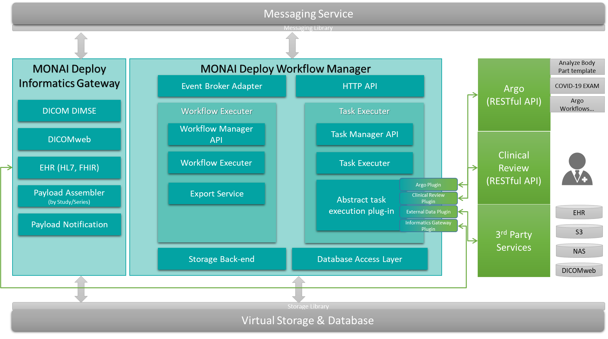

# MONAI Workflow Manager Software Architecture & Design



## Overview

The MONAI Deploy Workflow Manager (MWM) is the central hub for the MONAI Deploy platform. It routes received medical data from MONAI Informatics Gateway (or your custom ingestion service) to MONAI applications based on user defined Clinical Workflows. It is also responsible for monitoring application execution statuses and routing any results produced by the applications back to the configured destinations.

## Purpose

This document describes the detailed designs derived from the requirements defined in MONAI Workflow Manager Requirements.

## Scope

The scope of this document is limited to the design of the MONAI Workflow Manager. This design document does not address any design decisions belonging to other subsystems, such as MONAI Informatics Gateway, MONAI Deploy Application SDK.

## Assumptions, Constraints, Dependencies

## Definitions, Acronyms, Abbreviations

| Term        | Definition                                                                                                                                                       |
| ----------- | ---------------------------------------------------------------------------------------------------------------------------------------------------------------- |
| Export Sink | An export sink is a user-configured sink where the results (application-generated artifacts) are assigned to and later picked up by the export service clients. |
| Workflow | A workflow is a series of Tasks and their order of execution, including conditional routing statements determining which task will be executed.  |
| MWM         | MONAI Workflow Manager                                                                                                                                           |
| MIG         | MONAI Informatics Gateway                                                                                                                                        |

## Reference Documents

- [MONAI Workflow Manager Requirements](mwm-srs.md)

## Architecture Details

MONAI Workflow Manager includes a set of services and APIs to interconnect other subsystems in MONAI Deploy. Every service in the MWM runs on one or more threads that may receive requests from external systems/services. It also interacts with a database and other external services such as the Monai App Server or Argo for job management.

---

### API Surface Area

MWM provides the following APIs:

- **Workflows API**: A set of APIs to create, update and delete workflows.
- **Tasks API**: A set of APIs to query & update task status.
- **Credentials API**: Provides the ability to manager credentials to be used when the MWM communicates with external services.
---

### Internal Services

- **Payload Listener**: A service responsible for consuming messages about new input data from a message queue, and executing the Workflow Manager service.
- **Workflow Manager**: A service that executes pre-registered workflows on given input data.
- **Task Manager**: A service that orchestrates the execution of a single workflow task, invoking specific task plugins. It also fulfils calls to the Tasks API.
- **Task Dispatcher**: A service that dispatches and records jobs sent to the orchestration engines.
- **Export Service**: A service responsible emitting output notification events when workflows complete so listeners can retrieve output files.
- **Data Retention Service**: Monitors storage usages, apply data retention policies, and cleans up storage.

---
### Design

_Diagram to be re-added_

---

### APIs

#### Common - all APIs
###### Auth
APIs will all authenticate requests against a pre-configured OAUTH provider. Tokens will be used for authentication.

###### Error responses
In addition to success responses, any API call may result in the following error responses:
- Code: `400`: Bad Request. The input was malformed in some way.
  Content: A [Problem details](https://datatracker.ietf.org/doc/html/rfc7807) object with the validation error details.
- Code: `401`: Unauthorised. The request couldn't be authenticated, or the user doesn't have permissions to perform this action.
  Content: A [Problem details](https://datatracker.ietf.org/doc/html/rfc7807) object with the error details.
- Code: `404`: Not Found. The resource to retrieve/delete/update didn't exist.
  Content: A [Problem details](https://datatracker.ietf.org/doc/html/rfc7807) object.
- Code: `500`: Server error.
  Content: A [Problem details](https://datatracker.ietf.org/doc/html/rfc7807) object with server error details.

###### Content Type
The API will use JSON.
---
#### Credentials API

This API will allow storing credentials for later use in Task definitions. This will allow Tasks to perform authenticated calls to upstream services such as app servers or information systems.

_TBD_

---
#### Workflows API

The Workflows API allows clients to register Clinical Workflows. It will validate & store them.

##### POST /workflows
###### Body
A workflow definition as per the [workflow definition spec](mwm-workflow-spec.md).


#### Responses

- `200`:
  - Description: Workflow registered successfully.
  - Content: `{"id": UUID}`

##### PUT /workflows/WORKFLOW_ID
###### Body
A workflow definition as per the [workflow definition spec](mwm-workflow-spec.md).
May include a partial schema - the included attributes will be updated in the Workflow.


- `200`:
  - Description: Workflow updated successfully.
  - Content: none.

##### DELETE /workflows/WORKFLOW_ID


- `200`:
  - Description: Workflow updated successfully.
  - Content: none.

##### GET /workflows


- `200`:
  - Description: List of workflows.
  - Content:
      ```
      [
          {
            "workflow_id": UUID,
            "status": "active"
          }
      ]
      ```

##### GET /workflow

- `200`
  - Description: The workflow definition.
  - Content: The [workflow spec](mwm-workflow-spec.md)

---
#### Tasks API

URL: `/tasks`
Endpoints:
- Retrieve task by ID.
- Provide task result by ID: used by app servers to perform callbacks.
- Retrieve tasks (filter by current/time period)

_More details to be added._

### Internal Modules

#### Payload Listener
The Payload Listener monitors an input queue. The MIG (or a custom ingestion service) will add an event to that queue when new data is sent to the system.

Event schema: _TBD_


#### Workflow Manager
The workflow manager is responsible for running a workflow - executing tasks, passing metadata from one task to the other, and evaluating [Evaluators](mwm-workflow-spec.md#evaluators). Finally, it will hand over responsibility to the Export Notification service when the workflow is complete.

#### Task Manager
The task manager is responsible for orchestrating tasks. The workflow manager triggers it for each Task in a workflow. It's responsible for:
* Launching a specific task plugin
* Providing the task plugin with the metadata given to it by the Workflow Manager.
* Providing the task plugin with the path to an empty output directory.
* Providing the task plugin with the path to the input data.
* Listening for task Callbacks (see [Tasks API](#tasks-api)).
* Adding result metadata from a Task to the workflow execution context.
* Notifying the Workflow Manager when a task has completed.


#### Task Plugin
The task plugin is the component that executes a task. It contains the logic required to produce task outputs - this may be done by the plugin itself, or (more commonly) by the plugin invoking an external service using a network call. The Task plugin is the one that determines when a task has been finished, and that generates new metadata.

Initially supported plugins:
* MONAI Application Package execution: this plugin invokes the MONAI App Server to launch a MAP.
* Argo Workflow execution: this plugin invokes an Argo workflow.
* HTTP Plugin: this plugin executes synchronous API calls.
* HTTP Async Plugin: this plugin executes asynchronous API calls.

Responsibilities of plugins:
* Performing tasks
* Adding metadata to the execution context
* Adding task output files to the output directory

#### Export Service
The export service is used when a Task has an [output destination](mwm-workflow-spec.md#output-destinations) external to the system (ie not another task). The export services publishes an output event to a Pub/Sub service. Once published, this export operation is considered complete.

#### Data Retention Service

##### Retention Policies
As part of the [Workflow definition](mwm-workflow-spec.md), _retention policies_ can be applied to data generated by workflows and tasks. The Data Retention service is responsible for enforcing those policies.

By default, data is retained for `15` days after the workflow execution has completed.

##### Disk Space Monitoring
MWM reserves a small amount of storage space for internal use and stops triggering workflows when the used space is above the watermark.

##### Default options
- Reserved Storage Space (GB): `100`
- Watermark (%): `85`
- Data Retention (Days following workflow completion): `15`
