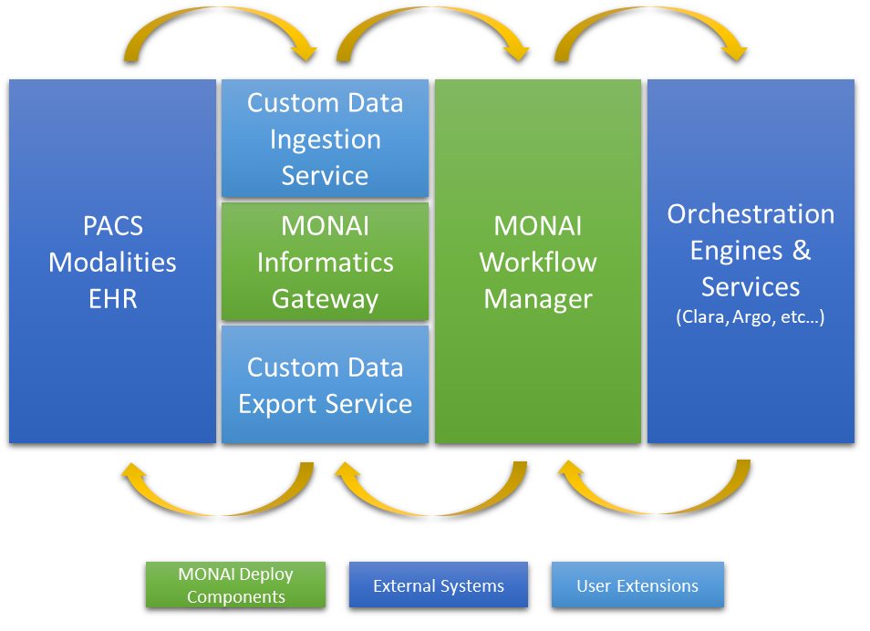

<!--
  ~ Copyright 2022 MONAI Consortium
  ~
  ~ Licensed under the Apache License, Version 2.0 (the "License");
  ~ you may not use this file except in compliance with the License.
  ~ You may obtain a copy of the License at
  ~
  ~ http://www.apache.org/licenses/LICENSE-2.0
  ~
  ~ Unless required by applicable law or agreed to in writing, software
  ~ distributed under the License is distributed on an "AS IS" BASIS,
  ~ WITHOUT WARRANTIES OR CONDITIONS OF ANY KIND, either express or implied.
  ~ See the License for the specific language governing permissions and
  ~ limitations under the License.
-->

# MONAI Deploy Workflow Manager Requirements

- [MONAI Deploy Workflow Manager Requirements](#monai-deploy-workflow-manager-requirements)
  - [Overview](#overview)
  - [Scope](#scope)
  - [Goal](#goal)
  - [Success Criteria](#success-criteria)
  - [Attributes of a Requirement](#attributes-of-a-requirement)
  - [Definitions, Acronyms, Abbreviations](#definitions-acronyms-abbreviations)
  - [(REQ-DI) Data Ingestion Requirements](#req-di-data-ingestion-requirements)
    - [[REQ-DI-001] MWM SHALL allow users to notify data arrival via shared storages](#req-di-001-mwm-shall-allow-users-to-notify-data-arrival-via-shared-storages)
    - [[REQ-DI-002] MWM SHALL allow users to upload data](#req-di-002-mwm-shall-allow-users-to-upload-data)
    - [[REQ-DI-003] MWM SHALL allow data to be associated with one or more workflows](#req-di-003-mwm-shall-allow-data-to-be-associated-with-one-or-more-workflows)
  - [(REQ-WF) Workflow Execution Requirements](#req-di-data-ingestion-requirements)
    - [[REQ-WF-001] MWM SHALL allow task outputs to be routed to other tasks](#req-wf-001-mwm-shall-allow-task-outputs-to-be-routed-to-other-tasks)
    - [[REQ-WF-002] MWM SHALL allow users to register workflows](#req-wf-002-mwm-shall-allow-users-to-register-workflows)
    - [[REQ-WF-003] MWM SHALL trigger workflows when notified of input data](#req-wf-003-mwm-shall-trigger-workflows-when-notified-of-input-data)
    - [[REQ-WF-004] MWM SHALL allow workflows to contain conditional statements](#req-wf-004-mwm-shall-allow-workflows-to-contain-conditional-statements)
    - [[REQ-WF-005] Workflow conditional statements SHALL be able to filter data by DICOM headers](#req-wf-005-workflow-conditional-statements-shall-be-able-to-filter-data-by-dicom-headers)
    - [[REQ-WF-006] Workflow conditional statements SHALL be able to filter data by FHIR data fields](#req-wf-006-workflow-conditional-statements-shall-be-able-to-filter-data-by-fhir-data-fields)
    - [[REQ-WF-007] MWM SHALL be able to route incoming data to specified workflows](#req-wf-007-mwm-shall-be-able-to-route-incoming-data-to-specified-workflows)
    - [[REQ-WF-008] MWM SHALL allow tasks to join and feed results into a downstream task](#req-wf-008-mwm-shall-allow-tasks-to-join-and-feed-results-into-a-downstream-task)
    - [[REQ-WF-009] Tasks SHALL have access to data and metadata generated by previous tasks in a workflow](#req-wf-009-tasks-shall-have-access-to-data-and-metadata-generated-by-previous-tasks-in-a-workflow)
    - [[REQ-WF-010] Workflow conditional statements SHALL be able to filter data by workflow metadata](#req-wf-010-workflow-conditional-statements-shall-be-able-to-filter-data-by-workflow-metadata)
  - [(REQ-DX) Data Export Requirements](#req-dx-data-export-requirements)
    - [[REQ-DX-001] MWM SHALL support multiple export sinks (destinations)](#req-dx-001-mwm-shall-support-multiple-export-sinks-destinations)
    - [[REQ-DX-002] MWM SHALL be able to route data to multiple sinks](#req-dx-002-mwm-shall-be-able-to-route-data-to-multiple-sinks)
    - [[REQ-DX-003] MWM SHALL allow users to create custom sinks](#req-dx-003-mwm-shall-allow-users-to-create-custom-sinks)
  - [(REQ-TM) Task Management Requirements](#req-tm-task-management-requirements)
    - [[REQ-TM-001] MWM SHALL provide a mechanism to develop plugins to support various application types](#req-tm-001-mwm-shall-provide-a-mechanism-to-develop-plugins-to-support-various-application-types)
    - [[REQ-TM-002] MWM SHALL allow app servers to notify it of task completion](#req-tm-002-mwm-shall-allow-app-servers-to-notify-it-of-task-completion)
    - [[REQ-TM-003] MWM SHALL track status/states of all jobs initiated with orchestration engines](#req-tm-003-mwm-shall-track-statusstates-of-all-jobs-initiated-with-orchestration-engines)
  - [(REQ-FR) Functional Requirements](#req-fr-functional-requirements)
    - [[REQ-FR-003] MWM SHALL provide a mechanism for clients to subscribe to notifications](#req-fr-001-mwm-shall-provide-a-mechanism-for-clients-to-subscribe-to-notifications)
    - [[REQ-FR-004] MWM SHALL allow users to define storage cleanup rules](#req-fr-002-mwm-shall-allow-users-to-define-storage-cleanup-rules)
  - [(REQ-NFR) Non Functional Requirements](#req-nfr-non-functional-requirements)
    - [[REQ-NFR-001] MWM SHALL link all workflow logs with a correlation ID](#req-nfr-001-mwm-shall-link-all-workflow-logs-with-a-correlation-id)

## Overview

The MONAI Deploy Workflow Manager (MWM) is the central hub for the MONAI Deploy platform. It handles received medical data from MONAI Informatics Gateway (or your custom ingestion service) in accordance to registered clinical workflows consisting of a multiple Tasks, such as MONAI Application Packages. It is also responsible for monitoring task execution statuses and routing any results produced by the tasks back to the configured destinations.

## Scope

The scope of this document is limited to the MONAI Deploy Workflow Manager. There are other subsystems of the MONAI Deploy platform such as [MONAI Deploy Informatics Gateway](https://github.com/Project-MONAI/monai-deploy-informatics-gateway) (responsible for interoperability with external systems) and [MONAI App SDK](https://github.com/Project-MONAI/monai-app-sdk) (which provides the necessary APIs for the application developer to interact with the MWM). However, this requirements document does not address specifications belonging to those subsystems.

## Goal

This proposal aims to enlist, prioritize, and clarify the requirements for MONAI Deploy Workflow Manager. Developers working on different software modules in MONAI Deploy Workflow Manager SHALL use this specification as a guideline when designing and implementing software for the MONAI Deploy Workflow Manager.

## Success Criteria

MWM SHALL process data that comes into the system, execute user-configured workflows, and route results back to external systems.

## Attributes of a Requirement

Each requirement defined in this document must include the following attributes:

**Requirement Body**: Describes the goal and purpose behind the requirement.

**Background**: Provides necessary background to understand the context of the requirements.

**Verification Strategy**: A high-level plan on how to test this requirement at a system level.

**Target Release**: Specifies the target for the release of MONAI Deploy Workflow Manager.

## Definitions, Acronyms, Abbreviations

| Term        | Definition                                                                                                                                                      |
| ----------- | ---------------------------------------------------------------------------------------------------------------------------------------------------------------       |
| Clinical Workflow | A defined DAG controlling task execution - it defines execution order, conditional statements and termination points.                                   |
| Task | A single step within a clinical workflow. A task can be fulfilled by an application. Each task can be one of the following types at a minimum: 1. A MONAI Application Package (MAP). 2. An Argo Workflow where each step is a container. 3. A client that invokes a web service synchronously. 4. A client that invokes a web service asynchronously                                |
| Application | An executable artifact (eg MONAI Application, Argo Workflow) which can be executed by a Task.  |                          |
| Evaluator         | An Evaluator performs checks based on conditions defined with metadata keys. Based on the evaluation results, a specific downstream task is executed.                                                                                                                                                                     |
| Metadata          | Metadata qualifies run-time characteristics of a clinical workflow. Each task can ingest one or more metadata elements & can also generate more. The execution environment provides a way to store metadata and access it.                                                                                                 |
| Export Sink       | An export sink is a user-configured sink where the results (task-generated artifacts) are assigned to and later picked up by the export service clients. |
| MIG               | MONAI Deploy Informatics Gateway                                                                                                                                |
| MWM               | MONAI Deploy Workflow Manager                                                                                                                                   |
| DAG | Directed Acyclic Graphs |
| Workflow | A DAG composed of one or more tasks. |

## (REQ-DI) Data Ingestion Requirements

### [REQ-DI-001] MWM SHALL allow users to notify data arrival via shared storages

An API MUST be provided to the data ingestion services, such as the Informatics Gateway, to notify data has arrived at the shared storage. E.g. a mounted NAS volume or cloud storage services.

#### Background

Medical imaging data are relatively large and transferring data between devices takes a significant amount of time of any given workflow. Oftentimes, shared storage is used to reduce the amount of data being transferred across services.

#### Verification Strategy

Verify that payloads can be stored by data ingestion services and dispatched to the workflow manager.

#### Target Release

MONAI Deploy Workflow Manager R1

### [REQ-DI-002] MWM SHALL allow users to upload data

#### Background

With the design of MONAI Deploy, the MWM does not interface with medical systems directly but rather through the Informatics Gateway (a data ingestion & export service). Therefore, there is a need to provide APIs to interface with any data ingestion services. In addition, it allows the users of the platform to extend these APIs to interface their systems using different messaging protocols or storage services.

#### Verification Strategy

Verify that payloads can be uploaded from data ingestion services and dispatched to the data discovery service.

#### Target Release

MONAI Deploy Workflow Manager R3

### [REQ-DI-003] MWM SHALL allow data to be associated with one or more workflows

#### Background

In scenarios where workflows are known for a given dataset, MWM could launch the specified workflow without launching all of them to reduce processing time.

#### Verification Strategy

Verify that WM only launches specified workflows when specified with a given dataset.

#### Target Release

MONAI Deploy Workflow Manager R3

## (REQ-WF) Workflow Execution Requirements

### [REQ-WF-001] MWM SHALL allow task outputs to be routed to other tasks

MWM SHALL allow the output of a task to be routed to other task(s).

#### Background

Given that hospitals may want to combine multiple tasks in a sequence (clinical workflow), this requirement allows users to route the output of one task to another.
This allows different applications to be used for different purposes within the same clinical workflow.

#### Verification Strategy

Deploy a workflow where the output of a task is routed to another task. Verify that the second task receives the output of the first task.

#### Target Release

MONAI Deploy Workflow Manager R1

### [REQ-WF-002] MWM SHALL allow users to register workflows

An API MUST be made available to users to register clinical workflows.

#### Background

System administrators need to be able to define which tasks run on what data and in what order.
It is therefore necessary to provide an API for users to register clinical workflows that control task execution.

#### Verification Strategy

Register a workflow using the API and ensure that data sent to the Workflow Manager is routed in accordance to that workflow.

#### Target Release

MONAI Deploy Workflow Manager R1

### [REQ-WF-003] MWM SHALL trigger workflows when notified of input data

MWM SHALL trigger registered clinical workflows when matching data is uploaded.

#### Background

Once a workflow is registered, it should be triggered when data matching that workflow is received by the payload notification API.

#### Verification Strategy

Deploy a clinical workflow and notify the Workflow manager of a new input payload. Verify that the clinical workflow was executed.

#### Target Release

MONAI Deploy Workflow Manager R1

### [REQ-WF-004] MWM SHALL allow workflows to contain conditional statements

MWM SHALL allow routing a task's data to other tasks and output sinks based on conditional logic.

#### Background

A workflow which only executes a direct sequence of steps is of limited benefit. For realistic use it's necessary to influence workflow routing based on conditional statements, so that the output of one task can influence the next destination (output sink or other task).

#### Verification Strategy

Deploy a workflow with a conditional statement. Trigger it with input data and ensure that the correct path is taken based on the input data.

#### Target Release

MONAI Deploy Workflow Manager R1

### [REQ-WF-005] Workflow conditional statements SHALL be able to filter data by DICOM headers

MWM SHALL allow users to query DICOM header tags in conditional statements using pre-built comparison functions such as equals, contains, greater, greater-than, less, less-than, etc...

#### Background

DICOM tags are often used to determine which task is relevant to which input. Given that the mechanism of controlling which task is executed are conditional statements in a clinical workflow, those statements need to be able to reference DICOM tags.

#### Verification Strategy

Given a workflow where a conditional statement checks a Dicom tag value, verify that the condition is either met/unmet, appropriately.

#### Target Release

MONAI Deploy Workflow Manager R1

### [REQ-WF-006] Workflow conditional statements SHALL be able to filter data by FHIR data fields

MWM SHALL allow users to define conditional statements based on FHIR data attributes using pre-built comparison functions such as equals, contains, greater, greater-than, less, less-than, etc...

#### Background

FHIR data attributes can contain relevant information regarding which task is relevant to the input. Given that the mechanism of controlling which task is executed are conditional statements in a clinical workflow, those statements need to be able to reference FHIR data.

#### Verification Strategy

Given a workflow where a conditional statement checks a FHIR data attribute, verify that the condition is either met/unmet, appropriately.

#### Target Release

MONAI Deploy Workflow Manager R3

### [REQ-WF-007] MWM SHALL be able to route incoming data to specified workflows

An input payload SHALL trigger all workflows where the originating system exists in the workflow's origins list, and no other workflows.

#### Background

Hospitals may have multiple clinical workflows deployed, each applicable to input data from different originating modalities. Workflow definitions should specify which modalities it should be triggered by - a new input should then trigger one or more workflows (or none) based on the sending modality.

#### Verification Strategy

Deploy two workflows that accept input from the same modality, and send data from that modality to the ingestion service. Verify that both workflows have been triggered.

#### Target Release

MONAI Deploy Workflow Manager R3

### [REQ-WF-008] MWM SHALL allow tasks to join and feed results into a downstream task

#### Background

In a multi-modality workflow, a task may need to create a report based on multiple upstream tasks where each runs an inference model on a different modality. This requirement enables a task to wait for the results from multiple upstream tasks before it executes.

#### Verification Strategy

Define a workflow where a task waits for multiple upstream tasks to complete.

#### Target Release

MONAI Deploy Workflow Manager R3

### [REQ-WF-009] Tasks SHALL have access to data and metadata generated by previous tasks in a workflow

Each task should have access to the data & metadata generated by prior tasks in the workflow. This includes any metadata as well as generated files on disk.

#### Background

For a workflow to be executed, it's necessary for tasks to operate on data created by previous tasks. This means that it's possible to run, for example, an inference model on an image that was segmented by a previous step.

#### Verification Strategy

Create a workflow with at least two steps - verify that the second task can make use of metadata and data from the first task.

#### Target Release

MONAI Deploy Workflow Manager R1

### [REQ-WF-010] Workflow conditional statements SHALL be able to filter data by workflow metadata

MWM SHALL allow users to define conditional statements based on workflow metadata attributes using pre-built comparison functions such as equals, contains, greater, greater-than, less, less-than, etc...

#### Background

An output of a specific step will often influence what should happen next - for example, an image analysis step can be used to identify the type of image and store that in the workflow metadata. Conditional statements can then route the execution to a task relevant to that image type.

#### Verification Strategy

Create a workflow with at least three steps where the metadata generated by the first step determines which step should be executed next - verify that the conditional statement works as expected.

#### Target Release

MONAI Deploy Workflow Manager R1

## (REQ-DX) Data Export Requirements

### [REQ-DX-001] MWM SHALL support multiple export sinks (destinations)

The MWM SHALL allow workflows to determine the export sinks of task results, allowing different tasks to store results in different sinks, depending on the workflow definition.

#### Background

An export sink is the termination point of a clinical workflow, and where a reference to the final result of the workflow is stored.
AI applications and medical imaging algorithms often output data in different formats that need to be exported back to HIS/RIS for reading, storage, or validation.
The concept of a sink allows routing output from a specific clinical workflow task to the right RIS/HIS destination.

#### Verification Strategy

Verify that the results can be exported to multiple destinations.

#### Target Release

MONAI Deploy Workflow Manager R1

### [REQ-DX-002] MWM SHALL be able to route data to multiple sinks

MWM SHALL allow a workflow to send outputs to multiple sinks, and output will be sent to all of them.

#### Background

There are a few common data protocols in the healthcare industry, such as DICOM, HL7, and FHIR. Often each protocol requires a dedicated client to communicate with it. Given that applications often produce outputs in different formats, each format, again, DICOM, HL7, or FHIR, must be handled by a dedicated client. This requirement would enable users to link one workflow to multiple sinks.

#### Verification Strategy

Link a workflow step to multiple sinks and run the workflow. Verify that the step output was sent to all sinks.

#### Target Release

MONAI Deploy Workflow Manager R3

### [REQ-DX-003] MWM SHALL allow users to create custom sinks

In order to support custom export services, MWM SHALL allow custom sinks to be created.

#### Background

Besides industry-standard protocols, such as DICOM, there may be other proprietary methods of transmitting data. This requirement allows users to enable their services to pick up any results produced by their applications.

#### Verification Strategy

Create an application to simulate an export service by implementing available APIs.

#### Target Release

MONAI Deploy Workflow Manager R1

## (REQ-TM) Task Management Requirements

### [REQ-TM-001] MWM SHALL provide a mechanism to develop plugins to support various application types

Besides executing applications registered with a MONAI App Server, MWM SHALL provide a mechanism to allow developing plugins to execute different types of tasks - for example apps registered with orchestration engines such as Argo.

#### Background

Many existing users have already invested in other orchestration engines which may have already become a requirement for their workflow. Therefore, supporting other OSS orchestration engines would simplify the integration of their existing environment with MONAI products.

#### Verification Strategy

Verify by repeating the same workflow and the same application on both MONAI App Server and another OSS orchestration engine, such as Argo.

#### Target Release

MONAI Deploy Workflow Manager R1

### [REQ-TM-002] MWM SHALL allow app servers to notify it of task completion

An API SHALL be available to app servers to notify the MWM of task completion, so that workflow execution can continue.

#### Background

Many tasks are long running and it's therefore not feasible for the MWM to synchronously wait for them to complete. Instead, the MWM should expose an API for callbacks to notify it that the task has completed, so that results can be processed and workflow execution can resume.

#### Verification Strategy

Execute an application using an app server and call the callback endpoint - verify that the workflow execution has resumed.

#### Target Release

MONAI Deploy Workflow Manager R1

### [REQ-TM-003] MWM SHALL track status/states of all jobs initiated with app servers

MWM SHALL track the status and states of all the jobs that it has initiated, so it can be used for reporting and allows other sub-components to react upon.

#### Background

Internally, in MWM, many subcomponents need to know the state and statuses of a running job. It is ideal to have a dedicated component that queries all the configured orchestration engines and share that information among other parts of the system.

#### Verification Strategy

Set up MWM with two orchestration engines, trigger a couple of jobs and make sure statues and states are stored in MWM.

#### Target Release

MONAI Deploy Workflow Manager R1

## (REQ-FR) Functional Requirements

### [REQ-FR-001] MWM SHALL provide a mechanism for clients to subscribe to notifications

MWM SHALL provide a mechanism so that users or clients can subscribe to the notification service to get job status or other system information.

#### Background

Maintainers typically require real-time or (daily, hourly, weekly) summaries on any failures experienced by the system, especially in cases of logical errors in running tasks.

#### Verification Strategy

Send a data format into a test task that is not able to process that data format and expect notifications on failures. Send fewer (one less) or more (one more) studies than required into a task that requires a specific amount of studies and expect notifications of failure(s).

#### Target Release

MONAI Deploy Workflow Manager R1

### [REQ-FR-002] MWM SHALL allow users to define storage cleanup rules

MWM SHALL provide functionalities to enable user define policy for storage clean-up.

#### Background

Often medical records, especially medical images, requires a large amount of disk storage, and given that disk storage space is always limited, there must exist a method to remove payloads. For MWM, payloads that are associated with a job that completes in a successful state may be removed. However, jobs that failed may need to be retained for further investigation.

#### Verification Strategy

Verify that payloads are removed based on users' configuration.

#### Target Release

MONAI Deploy Workflow Manager R2

## (REQ-NFR) Non Functional Requirements

### [REQ-NFR-001] MWM SHALL link all workflow logs with a correlation ID

MWM SHALL store all the logs generated by a workflow execution with a unique correlation ID.

#### Background

It is often necessary to view what the system has done and what has been executed for a given input. To do that, correlation IDs are used - the initial input to the system generates a specific correlation ID, which can be used to retrieve all associated logs.

#### Verification Strategy

Execute a workflow and view its logs - ensure they all contain the correlation ID.

#### Target Release

MONAI Deploy Workflow Manager R1
