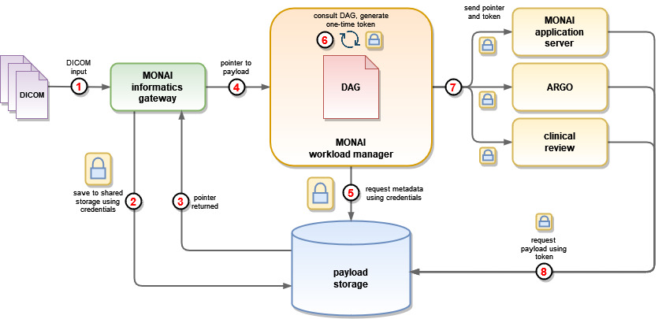

<!--
  ~ Copyright 2022 MONAI Consortium
  ~
  ~ Licensed under the Apache License, Version 2.0 (the "License");
  ~ you may not use this file except in compliance with the License.
  ~ You may obtain a copy of the License at
  ~
  ~ http://www.apache.org/licenses/LICENSE-2.0
  ~
  ~ Unless required by applicable law or agreed to in writing, software
  ~ distributed under the License is distributed on an "AS IS" BASIS,
  ~ WITHOUT WARRANTIES OR CONDITIONS OF ANY KIND, either express or implied.
  ~ See the License for the specific language governing permissions and
  ~ limitations under the License.
-->

# Storage

Input data, metadata & task output artifacts are all stored in a shared storage layer.

### Architecture Diagram

### Storage Backend

For the first releases (TBD) storage will be any S3 compatible resource. In a cloud-ready environment this can be AWS S3, and in environments restricted to on-premise storage it can be local services such as [Minio](http://min.io).

In the future, alternative storage backends should be supported.

### Access control

#### Workflow Manager
The MWM will be responsible for managing access to objects. It will have root level access and will be able to grant specific access to applications.

#### Monai Informatics Gateway
The informatics gateway will have write-only access to a specific storage bucket. This will be used to save the original input, and a reference will then be sent to the MWM.

#### Workflow Manager Task Plugins
Task plugins, as executable code within the MWM process, will theoretically have access to the entire object store. In practice, when executed they will receive references to specific [artifacts](/docs/setup/mwm-workflow-spec.md#artifacts).

It is the plugins' responsibility to ensure Applications have access to the artifacts they need. How they do so depends on the plugin's architecture - they could send files as payloads in an HTTP call, or they could generate temporary access tokens and send these along with the object reference to app servers.

### Output Data
Output data is handled in a similar way - app servers relay the information to the task plugin (either as HTTP payloads in the callback call, or as references to accessible resources).
The plugins are then responsible for saving defined artifacts to the shared storage.

