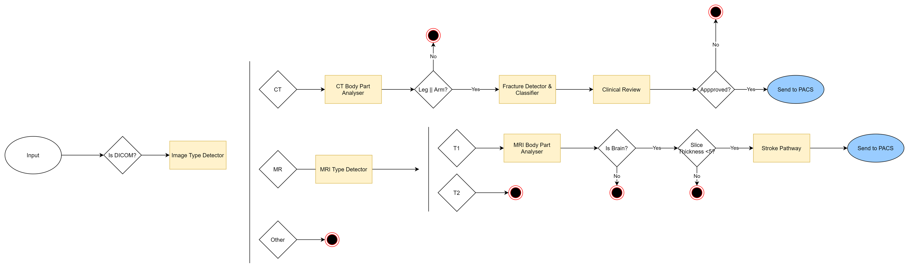

<!--
  ~ Copyright 2022 MONAI Consortium
  ~
  ~ Licensed under the Apache License, Version 2.0 (the "License");
  ~ you may not use this file except in compliance with the License.
  ~ You may obtain a copy of the License at
  ~
  ~ http://www.apache.org/licenses/LICENSE-2.0
  ~
  ~ Unless required by applicable law or agreed to in writing, software
  ~ distributed under the License is distributed on an "AS IS" BASIS,
  ~ WITHOUT WARRANTIES OR CONDITIONS OF ANY KIND, either express or implied.
  ~ See the License for the specific language governing permissions and
  ~ limitations under the License.
-->

# Clinical Workflow Specification Language

## Overview

The MONAI Workflow Manager is responsible for executing pre-registered clinical workflows. This document describes how to create a workflow and what the language allows.

A workflow is a standard template that contains a list of tasks that can be ran in sequence/parallel. Each task has a specific [Task Type](#task-types-1), each task may require different arguements.

The first task to be ran, will always be the first task in the list. The next task/tasks to be ran must be listed in the [Task Destinations](#task-destinations) of the task. A workflow requires at least one task.

Workflows can be created or updated via the [Workflow API](https://github.com/Project-MONAI/monai-deploy-workflow-manager/blob/develop/docs/api/rest/workflow.md).

# Contents

- [Clinical Workflow Specification Language](#clinical-workflow-specification-language)
  - [Overview](#overview)
- [Contents](#contents)
- [Workflow](#workflow)
  - [Workflow Revision](#workflow-revision)
  - [Workflow Object](#workflow-object)
      - [Examples](#examples)
    - [Informatics Gateway](#informatics-gateway)
    - [Tasks](#tasks)
- [Task Object](#task-object)
    - [Task Types](#task-types)
    - [Example of Plugin Names](#example-of-plugin-names)
    - [Example Task Objects](#example-task-objects)
  - [Common Fields](#common-fields)
    - [Data Attributes for specific task types](#data-attributes-for-specific-task-types)
      - [Router](#router)
      - [Export](#export)
      - [Plugin](#plugin)
    - [Task Arguments](#task-arguments)
      - [Argo](#argo)
    - [Clinical Review](#clinical-review)
    - [Router](#router-1)
    - [Export](#export-1)
  - [Artifacts](#artifacts)
      - [Artifact Map](#artifact-map)
      - [Artifact](#artifact)
    - [Supported artifact variables](#supported-artifact-variables)
      - [DICOM Input](#dicom-input)
      - [Execution Output Artifacts](#execution-output-artifacts)
      - [Execution Output Directory](#execution-output-directory)
    - [Artifact usage in Plugins](#artifact-usage-in-plugins)
      - [Argo Artifacts](#argo-artifacts)
  - [Destinations](#destinations)
    - [Task Destinations](#task-destinations)
  - [Evaluators](#evaluators)
    - [Supported Evaulators](#supported-evaulators)
    - [Context](#context)
      - [Execution Context](#execution-context)
      - [Result Metadata \& Execution Stats - Using Dictionary Values](#result-metadata--execution-stats---using-dictionary-values)
      - [Argo Metadata](#argo-metadata)
      - [Handled Exception Metadata](#handled-exception-metadata)
      - [DICOM Tags](#dicom-tags)
      - [Patient Details Context](#patient-details-context)
      - [Workflow Context](#workflow-context)

# Workflow

## Workflow Revision

A workflow revision is a wrapper object that is automatically generated when a workflow is created. This object contains the auto-generated workflow Id and the workflow revision number that is used to keep track of updates.

When a workflow has been posted via the API, the workflow will be wrapped in a workflow revision. When calling <b>GET /workflows</b>, a list of the latest workflow revisions will be returned.

When Updating a workflow via a PUT, a new revision will be added and used from then on.

The following is an example of a workflow revision (note: the [Workflow Object](#Workflow-object) is not a real world example, this is just to show the top level workflow revision object)

```json
{
      "id": "c3834b53-8cc2-4a74-90f8-8f0111a6d523",
      "workflow_id": "cf1ffa05-0729-4846-9f9f-849f4877af81",
      "revision": 1,
      "workflow": {
        "name": "argo_export",
        "version": "1.0.0",
        "description": "Workflow with Argo and Export task",
        },
        "tasks": [
          {
            "id": "mean-pixel-calc",
            "description": "mean-pixel-calc operator and reporter",
            "type": "argo"
          },
          {
            "id": "export-report",
            "description": "Export encapsulated pdf for mean-pixel-calc",
            "type": "export"
          }
        ]
      }
```

## Workflow Object
This is the top-level object in a workflow spec. It contains the following properties:

| Property | Type |
|------|------|
|name|str (15)|
|version|str|
|description|Optional[str] (200)|
|informatics_gateway|[InformaticsGateway](#informatics-gateway)|
|tasks|list[[Task](#tasks)]|
|dataRetentionDays|int|
|predicate|string[]|

The following is an example of the structure of a workflow.

<b>workflow</b>\
┣ name \
┣ version \
 ┣ description\
 ┣ informatics_gateway\
 ┃ ┣ ae_title\
 ┃ ┣ data_origins\
 ┃ ┗ export_destinations\
 ┗ tasks\
&nbsp;&nbsp;&nbsp; ┣ task1\
&nbsp;&nbsp;&nbsp; ┣ task2\
&nbsp;&nbsp;&nbsp; ┗ task3\
┣ dataRetentionDays\
┣ predicate  [A detailed breakdown of predicate logic can be found here.](https://github.com/Project-MONAI/monai-deploy-workflow-manager/blob/develop/guidelines/mwm-conditionals.md)


#### Examples
The following is an example of a complete workflow:


An example of a workflow with two tasks:

1. Argo task
2. Export Task

(Dated 14/10/2022)
```json
{
	"name": "argo_export",
	"version": "1.0.0",
	"description": "Workflow with Argo and Export task",
	"informatics_gateway": {
		"ae_title": "MONAI",
		"export_destinations": [
			"ORTHANC"
		]
	},
    "dataRetentionDays": -1,
    "predicate" : []
	"tasks": [
		{
			"id": "mean-pixel-calc",
			"description": "mean-pixel-calc operator and reporter",
			"type": "argo",
            "args": {
                "namespace": "argo",
                "workflow_template_name": "argo-workflow-1",
                "server_url": "https://argo-server.argo:2746",
                "allow_insecure": "true"
            },
			"task_destinations":[
				{
					"Name": "export-report"
				}
			],
			"artifacts": {
				"input": [
					{
						"name": "input-dicom",
						"value": "{{ context.input.dicom }}",
                        "mandatory": true
					}
				],
				"output": [
					{
						"name": "report-dicom"
					}
				]
			}
		},
		{
			"id": "export-report",
			"description": "Export encapsulated pdf for mean-pixel-calc",
			"type": "export",
			"args": {
			},
			"export_destinations":[
				{
					"Name": "ORTHANC"
				}
			],
			"artifacts": {
				"input": [
					{
						"name": "report-dicom",
						"value": "{{ context.executions.mean-pixel-calc.artifacts.report-dicom }}",
						"mandatory": true
					}
				]
			}
		}
	]
}
```

### Informatics Gateway
This section contains the IG configuration. Specifically, it contains the following properties:

| Property | Type | Description |
|------|------|------|
|ae_title|str|The AE title for this workflow. Only data sent to this AE title will be processed by this workflow.|
|data_origins|Optional[list[str]]|List of possible origin systems. These should be registered with the informatics gateway.|
|export_destinations|list[str]|List of possible destinations for the output of tasks in this workflow. Informatics gateways can subscribe to notifications of output to these destinations.|

```json
{
    "ae_title": "MY_AET",
    "data_origins": ["MY_MODALITY"],
    "export_destinations": ["PROD_PACS"]
}
```
The above specifies that the workflow should be triggered for inputs sent to the ae-title "MY_AET" from "MY_MODALITY".
It also defines the "PROD_PACS" output destination, meaning that it can be used:
* By tasks as the [destination of their output](#output).
* By subscribers to [export notifications](https://github.com/Project-MONAI/monai-deploy-workflow-manager/blob/develop/guidelines/mwm-sadd.md#export-service).

### Tasks
Tasks are the basic building block of a workflow. They are provided as a list - the first Task in the list is executed when the workflow is triggered.
Subsequent tasks are triggered by the `task_destinations` specified by previous tasks.

# Task Object

### Task Types
These tasks are borken down into different types:

| Type | Purpose |
| ---- | ------- |
| Router | A task to control the flow through a workflow |
| Export | A task to trigger the exporting of data |
| External App | A task to trigger execution of an external app |
| `Plugin_Name` | A task which has a matching Plugin installed & enabled |


### Example of Plugin Names
Tasks are implemented by task _plugins_. The following are the officially supported plugins that are bundled with the MWM.

| Type | Purpose |
| ---- | ------- |
| Argo | A task which will trigger the execution of an Argo Workflow |
| Docker | A task which will create and run a docker container |
| Clinical Review | A task which will allow clinicians to review a previous task |

### Example Task Objects
The following are examples of the task json structure including required args for the following task types:

<b> Argo:</b>

```json
{
  "id": "aide-task-id",
  "description": "trigger simple argo workflow",
  "type": "argo",
  "args": {
    "namespace":"argo",
    "workflow_template_name": "aide-artifact-passing-j5ndx",
    "server_url": "https://localhost:2746",
    "allow_insecure": true
  },
  "artifacts": {
    "input": [
      {
        "name": "input-dicom",
        "value": "{{ context.input.dicom }}"
      }
    ],
    "output": [
      {
        "name": "report-dicom",
        "Mandatory": true
      }
    ]
  },
  "task_destinations": [
    {
      "name": "export-task-id"
    }
  ]
}
```

<b> Export:</b>

```json
{
  "id": "export-task-id",
  "description": "Export encapsulated pdf for mean-pixel-calc",
  "type": "export",
  "args": {
  },
  "export_destinations":[
    {
      "Name": "ORTHANC"
    }
  ],
  "artifacts": {
    "input": [
      {
        "name": "report-dicom",
        "value": "{{ context.executions.aide-passing.artifacts.report-dicom }}",
        "mandatory": true
      }
    ]
  }
}
```

<b> Router:</b>

```json
{
  "id": "router-task-id",
  "description": "router task to route MR and US studies",
  "type": "router",
  "task_destinations":[
    {
      "Name": "argo-task-mr",
      "Conditions": ["{{ context.dicom.series.all('0008','0060') }} == 'MR'"]
    },
    {
      "Name": "argo-task-us",
      "Conditions": ["{{ context.dicom.series.all('0008','0060') }} == 'US'"]
    }
  ]
}
```

## Common Fields
All task objects can have these attributes:-

| Property | Type | Description |
|------|------|------|
|id|str (50)|The id for this task. This should be unique within the current workflow. Supported chars: Alphanumeric _ - |
|description|str (2000)|A human readable task description|
|type|str (2000)|The task type - this determines the plugin that will be used to execute the task. See [task types](#task-types) for supported tasks.|
|args|dictionary|a list of key value pairs containing task specific arguments.|
|timeout_minutes|number|How long the task is allowed to run before it is canceled|
|task_destinations|Optional[list[[TaskDestination](#task-destinations)]]|An optional list of possible tasks that could be executed following this task. They will be executed if their conditions are true.|

### Data Attributes for specific task types
Depending of the type of task, the task object may contain additional fields.

#### Router
Router tasks don't have additional fields. They are used to contain `task_destinations` so that workflow processing can be directed to the desired next step.

#### Export
These are task types that allow for artifacts to be exported based on the input artifacts list. This task type should not have Out artifacts listed.
The task also requires these extra attributes:-

| Property | Type | Description |
|------|------|------|
|export_destinations|Optional[list[[ExportDestination](#export-destinations)]]|An optional lists of possible export destinations to which the output of this task can be sent. This must be an export destinations already defined within the [Informatics Gateway](#informatics-gateway) section of  the workflow configuration.||
|artifacts|[ArtifactMap](#artifacts)| Only Input artifacts of this task that should be sent to this export destination..

Example (output sent to another task if the patient is female, otherwise to PACS):
```json
{
    ...task...
    "export_destinations": [
        {
            "name": "PROD_PACS"
        }
    ],
    "artifacts": {
      "input": [
        {
          "name": "report-dicom",
          "value": "{{ context.executions.aide-passing.artifacts.report-dicom }}",
          "mandatory": true
        }
      ]
    },
    "task_destinations": [
        {
            "name": "my-task-id",
            "conditions": ["{{context.dicom.series.all('0010','0040')}} == 'F'"]
        }
    ],
    ...
}
```

Export destinations define an external location to which the output of the task can be sent. This will take the form of an event published to a pub/sub service notifying of an available export to a specific destination reference. Most commonly, the export location will be a PACs system and the notification will be picked up by the Monai Informatics Gateway.

#### External App
These are task types that allow for execution of external apps and in 
structure are identical to the Export type above.


#### Plugin
These are tasks are Named the same as the installed Pluging.
The task also requires these extra attributes:-

| Property | Type | Description |
|------|------|------|
|args|optional[dictionary]|A dictionary of key value pairs that will be available to the task plugin when executing this task. This schema of this object is defined by the plugin itself, often having set required keys|
|artifacts|[ArtifactMap](#artifacts)|Input & output artifacts of this task.

The args requirements for argo plugin can be found [here](#argo).

### Task Arguments
Each task plugin requires specific arguments to be provided in the args dictionary. This allows all task types to support as many additional values as necessary without the need to bloat the workflow spec.

#### Argo
The Argo plugin triggers workflows pre-deployed onto an [Argo workflow server](https://argoproj.github.io/argo-events/).

**type**: argo

The Task's "args" object should contain the following fields:

| Property | Type | Required | Description |
|------|------|------|------|
|workflow_template_name|string|Yes|The ID of this workflow as registered on the Argo server.|
|priority_class|string|No|The name of a valid Kubernetes priority class to be assigned to the Argo workflow pods.|
|gpu_required|string|No|Whether a GPU is to be used by this task.|
|memory_gb|string|No|The maximum amount of memory in gigabytes this task may use.|
|cpu|string|No|The maximum amount of CPU this task may use.|

For more information about Kubernetes requests & limits, see https://kubernetes.io/docs/concepts/configuration/manage-resources-containers/.

### Clinical Review

The Clinical Review plugin is used to pause a workflow until a task has been reviewed by a clinician.

**type**: aide-clinical-review

The Task's "args" object should contain the following fields:

| Property | Type | Required | Description |
|------|------|------|------|
|reviewed_task_id|string|Yes|The task id of a previous task that is to be reviewed.|
|reviewer_roles|Optional[string]|No|A comma seperated list of reviewer roles allowed to approve/reject. e.g `clinician, admin, testrole` (If not provided the default `clinician` role will be set)|
|application_name|string|Yes|The application name that is being reviewed.|
|application_version|string|Yes|The application version that is being reviewed.|
|mode|string|Yes|The application mode. (must be: `QA`, `Research`, `Clinical`)|
|workflow_name|string|Yes|Workflow Name.|

### Router
None required.

### Export
None Required.

## Artifacts

Tasks can be provided with input artifacts, and they generate output artifacts.
Inputs can contain artifacts generated by previous tasks or the original workflow input.

The root level Task object contains an optional ArtifactMap object:

#### Artifact Map

| Property | Type | Description |
|------|------|------|
|input|list[Artifact]|List of artifacts that are needed by this task.
|output|optional[list[Artifact]]|List of artifacts that are generated by this task.


#### Artifact
Each Artifact contains at least two elements:

| Property | Type | Required | Description |
|------|------|------|-----|
|name|str|Always|The name of this artifact.|
|value|Artifact identifier|Required for inputs, optional for outputs.|The context variable for this artifact (see example). If defined for output, that value will be used instead of a Task-generated one.|
| mandatory| bool | No (default true) | Determines whether this artifact is mandatory. If a mandatory artifact doesn't exist the task is marked as a failure and workflow execution stops. |


As you can see in the example below, input artifacts require a _value_. This is a reference to a previously generated artifact, or to `context.input` - a value for an artifact representing the original input that triggered the workflow.

### Supported artifact variables

#### DICOM Input

If payload DICOM inputs are to be used in a given task, the value of the input must be `context.input.dicom`. This will to resolve to the `{payloadId}/dcm` folder within Minio / S3.

Example:
```json
"input": [
    {
      "name": "input_dicom",
      "value": "{{ context.input.dicom }}",
      "mandatory": true
    }
]
```

#### Execution Output Artifacts

If a tasks requires an output artifact of a previous task, this can be accessed with the value `context.executions.TASK_ID.artifacts.ARTIFACT_NAME`.


Example:

Task 1 (Task Id: `task_1`) Artifact Output:
```json
"output": [
    {
      "name": "output_fracture_report",
      "mandatory": true
    }
]
```

Task 2 (Task Id: `task_2`) Artifact Input:
```json
"input": [
    {
      "name": "input_fracture_report",
      "value": "{{ context.executions.task_1.artifacts.output_fracture_report }}",
      "mandatory": true
    }
]
```

#### Execution Output Directory

If a tasks requires access to an entire output directory of a task, this can be resolved via `context.executions.TASK_ID.output_dir`.

Example:

Task 1 (Task Id: `task_1`)

Task 2 (Task Id: `task_2`) Artifact Input:
```json
"input": [
    {
      "name": "task_1_output_dir",
      "value": "{{ context.executions.task_1.output_dir }}",
      "mandatory": true
    }
]
```

> ##### Note regarding artifact names:
> it's not necessary for the input name to be identical to the _name_ specified in the output of a previous task. Output names are used to allow access using the context object. The input name should be what the current task expects to receive.


Example:
```json
"input": [
    {
      "name": "input_dicom",
      "value": "{{ context.executions.image_type_detector.artifacts.dicom }}",
      "mandatory": true
    }
],
"output": [
    {
      "name": "fracture_report",
      "mandatory": true
    }
]
```

Artifacts also support path suffixes after the variables like so, these can be used to further dictate an artifact path:

Example:
```json
"input": [
    {
      "name": "input_dicom",
      "value": "{{ context.input.dicom }}/study1",
      "mandatory": true
    }
],
"output": [
    {
      "name": "fracture_report",
      "mandatory": true
    }
]
```

### Artifact usage in Plugins

It is determined by the plugin how artifacts are used and manipluated. There may be considerations for how plugins should be set up.

#### Argo Artifacts

Artifacts within Argo workflows must have the same name as the Clinical workflow in order for them to be mapped correctly.

Argo Workflow Artifact:
```YAML
artifacts:
  - name: input-dicom
    path: /tmp/dicom_input
    s3:
      key: argo/inputs/artifacts/input-dicom
```

Clinical Workflow Artifact:
```json
"input": [
    {
      "name": "input_dicom",
      "value": "{{ context.executions.image_type_detector.artifacts.dicom }}",
      "mandatory": true
    }
]
```

The resolved path from `{{ context.executions.image_type_detector.artifacts.dicom }}` will override the `key` property in the Argo workflow. This is the mapped location for the artifact in S3/Minio.

> ##### Creating artifacts:
> How artifacts are created is beyond the scope of this document. The specifics differ depending on which Task Plugin is being used.
>
> It is possible to "hard-code" artifacts by providing the value for an output artifact. This is useful for tasks that are auxillary such as utility functions (e.g. email sending) or review steps - those tasks output the same input they've received. By default, outputs will be stored in the tasks output directory if no value is provided.

## Destinations
Destinations allow the workflow manager to determine what should happen to the output of a task. There are two types of destinations – task destinations, which reference another task in the workflow to be executed and [export](#export) destinations, which reference a location external to the workflow manager.

### Task Destinations

Task destinations define the next task to be executed. A task can have multiple task destinations, which can mean that two tasks will be run in parallel.
If a task has no task destinations, and there are no more running tasks, the workflow will finish.

Sometimes the destination will differ based on some condition. For this, [evaluators](#evaluators) can be used as conditions for output destinations.

The basic format is as follows:

| Property | Type | Description |
|------|------|------|
|name|str|The name of the destination. for task destinations this must be a task's ID (each task can only be triggered once)|
|conditions|Optional[list[Evaluator]]|An optional array of [Evaluators](#evaluators) that need to be met in order for this destination to be used.|


Example (run my-task-id when the patient is female):

```json
{
    ...task...
    "task_destinations": [
        {
            "name": "my-task-id",
            "conditions": ["{{context.dicom.series.all('0010','0040')}} == 'F'"]
        },
    ],
    ...
}
```

The following examples both function the same and act as an AND condition.

```json
{
    ...task...
    "task_destinations": [
        {
            "name": "my-task-id",
            "conditions": ["{{context.dicom.series.all('0010','0040')}} == 'F' AND {{context.dicom.series.all('0010','0040')}} == 'M'"]
        },
    ],
    ...
}
```

```json
{
    ...task...
    "task_destinations": [
        {
            "name": "my-task-id",
            "conditions": ["{{context.dicom.series.all('0010','0040')}} == 'F'", "{{context.dicom.series.all('0010','0040')}} == 'M'"]
        },
    ],
    ...
}
```

## Evaluators
Conditional evaluators are logical statement strings that may be used to determine which tasks are executed. They can make use of the execution context _metadata_ and dicom tags. All conditions must evaluate to true in order for the task to be triggered.

 [A detailed breakdown of conditional logic can be found here.](https://github.com/Project-MONAI/monai-deploy-workflow-manager/blob/develop/guidelines/mwm-conditionals.md)

### Supported Evaulators


 Conditional evaluators should support evaluating workflow variables against predefined values with the following operators:

    < (Valid for integers)

    > (Valid for integers)

    <= (Valid for integers)

    >= (Valid for integers)

    == (Valid for integers and strings)

    == NULL (Valid for integers and strings)

    != (Valid for integers and strings)

    CONTAINS (Valid for integers and strings compared to lists)

    NOT_CONTAINS (Valid for integers and strings compared to lists)

more information on conditionals can be found  [Conditionals Docs](..\..\guidelines\mwm-conditionals.md)

### Context
The workflow metadata is any data that can be used by Evaluators. This includes metadata added by previous tasks, but can also include metadata about the input files (most notably DICOM tags).
Metadata is available with the `context` object:

| Property | Type | Description |
|------|------|------|
|correlation_id|str|The unique ID identifying this Workflow execution.|
|input|Artifact|A reference to an artifact representing the workflow input data.|
|executions|Execution Context|This object contains the data added by previous tasks.|
|dicom|DICOM Tags object|This object contains the DICOM tags of the input.|

####  Execution Context
The `executions` object contains data generated by previous executions.
Each execution is represented by an `Execution` object, which can be accessed by Task ID:
`context.executions.TASK_ID`

The Execution object contains the following properties:

| Property | Type | Description |
|------|------|------|
|execution_id|str|The unique ID identifying task execution.|
|task_id|str|The ID of this task in the workflow.|
|previous_task_id|str|The ID of the previous calling task in the workflow.|
|output_dir|str|Path to the output directory of this task.|
|execution_stats|dict|The details of the executed task. |
|start_time|timestamp|The UTC timestamp of when this task execution began.
|end_time|Optional[timestamp]|The UTC timestamp of when this task execution ended.
|status|string|One of "Created", "Dispatched" or "Accepted", "Succeeded", "Failed", "Canceled".
|error_msg|Optional[str]|An error message, if one occurred.
|result|Optional[dict]|The metadata that was [added by the previous Task](#result-metadata-&-execution-stats---using-dictionary-values).

Example (status):
```python
{{ context.executions.body_part_identifier.status }} == 'Succeeded'
```

#### Result Metadata & Execution Stats - Using Dictionary Values

The Result Metadata and Execution Stats are populated by the plugin and are added to the workflow instance once a task is completed to provide some output of a task. Each plugin will have its own implementation to populate the result metadata.

Because `result` and `execution_stats` are a dictionary, the section after `context.executions.task_id.result` or  `context.executions.task_id.execution_stats` is the key to be checked in the result/execution_stats dictionary.

For conditional statements, the key specified is case sensitive and must match exactly to the key which has been output by the model and saved in the result/execution_stats dictionary.

The result metadata is a dictionary of any type, which means the value can be a string, int, date, boolean etc. They will be parsed to a string for the comparison. An example of the following cases can be seen below.

Example String(result):
```python
{{ context.executions.body_part_identifier.result.body_part }} == 'leg'
```


Example Boolean(result):
```python
{{ context.executions.body_part_identifier.result.is_body_part }} == 'True'
```


Example Number(result):
```python
{{ context.executions.body_part_identifier.result.body_part_count }} == '10.5'
```


Example Date(result):
```python
{{ context.executions.body_part_identifier.result.body_part_count_date }} == '2022-12-25T00:00:00'
```

#### Argo Metadata

The result metadata for an Argo task is populated by a `metadata.json` that is included somewhere within the tasks output directory. The contents of the JSON file must be in the format of a dictionary, and should be generated by the argo model.

```json
{
    "inference_status": true,
    "result_value": 2.5
}
```

If metadata is to be used in a conditional the `metadata.json` must be present somewhere in the output directory and a valid JSON dictionary. It will automatically be imported if it is in the directory.

An example format of the metadata.json can be found below:

execution stats are populated from the argo execution values returned automatically.

#### Handled Exception Metadata
Application models can throw handled exceptions, to do this your application model should output the properties "exception" and "exception_message" to the `metadata.json`

Example...
```json
{
  "exception": "NoDicomFilesException",
  "exception_message": "No dicom files found."
}
```

We recommend your application exits execution once the metadata.json has been written.

This exception can be used in the workflow task destinations queries for example like the following examples...

```python
{{ context.executions.task_id.result.exception }} == 'NoDicomFilesException' && {{ context.executions.task_id.result.exception_message }} == 'No dicom files found.'
```

```python
{{ context.executions.task_id.result.exception_message }} CONTAINS 'No dicom files'
```

```python
{{ context.executions.task_id.result.exception }} == NULL
```


#### DICOM Tags
When the input data is DICOM, Evaluators can use DICOM tag values in conditional statements.
DICOM tags are available in `context.dicom`. The reference for that object is as follows:

| Property | Type | Description |
|------|------|------|
|study_id|str|The Study ID tag (0020,0010)|
|tags|dict|All DICOM metadata tags that are common across all series & slices in this study.|
|series|list|The list of DICOM series in this study.|

Each `Series` object contains the tags of that series. They can be accessed either with dot notation or using key lookups (see examples below).

The DICOM tag matching engine allows evaluating conditions against all series and resulting in True if the condition matches _any one_ of them:
```python
{{context.dicom.series.any('0018','0050')}} < '5'
```

In order to check a certain tag across _all_ series, use the study level tags. For example, to only evaluate True for Female patients:
```python
{{context.dicom.series.all('0010','0040')}} == 'F'
```

When parsing decimals from dicoms trailing 0's will be trimmed
for example say the data in '0018','0050' contains '1.6000' the 0's will be trimmed to 1.6
```python
{{context.dicom.series.any('0018','0050')}} == '1.6000'
```
so in this example expression will fail, you would have to do following expression to pass
```python
{{context.dicom.series.any('0018','0050')}} == '1.6'
```

if you Dicom Metadata contains array of items for example
```python
  "00200037": {
    "vr": "DS",
    "Value": [
      1,
      0,
      0,
      0,
      1,
      0
    ]
  },
```
this will be evaluated too an array of items and can be used with CONTAINS and NOT_CONTAINS so you could do for example...
```python
{{context.dicom.series.all('0020','0037')}} CONTAINS '1'
```


#### Patient Details Context
When a workflow is triggered, some patient details are attempted to be retrieved from any input DICOM Images.
Patient Details values are available in `context.input.patient_details`. The following are the only currently supported values (All values may be NULL if not found in input DICOMs):

| Property | Type | Description |
|------|------|------|
|id|str|The patient id of the patient (Tag: 0010,0020)|
|name|str|The patient name. (Tag: 0010, 0010)|
|sex|str|The sex of the patient. (Tag: 0010, 0040)|
|dob|date|The date of birth of the patient. Format: dd/MM/yyyy (Tag: 0010, 0030)|
|age|int|Age of the patient in years. (Tag: 0010, 1010)|
|hospital_id|str|The hospital id of the patient. (Tag: 0010, 0021)|

Examples:

Name:
```python
{{context.input.patient_details.name}} == 'Fred'
```

Dob:
```python
{{context.input.patient_details.dob}} == '19/09/1996'
```

Sex:
```python
{{context.input.patient_details.sex}} == 'F'
```

#### Workflow Context
Workflow context allows values within the workflow spec to be used as part of the conditional execution. Workflow conext values are available via `context.workflow`

The following are the only currently supported values:

| Property | Type | Description |
|------|------|------|
|name|str|The workflow name.|
|description|str|The workflow description.|

Examples:

Name:
```python
{{context.workflow.name}} == 'workflowname'
```

Description:
```python
{{context.workflow.description}} == 'This workflow is a valid workflow'
```
