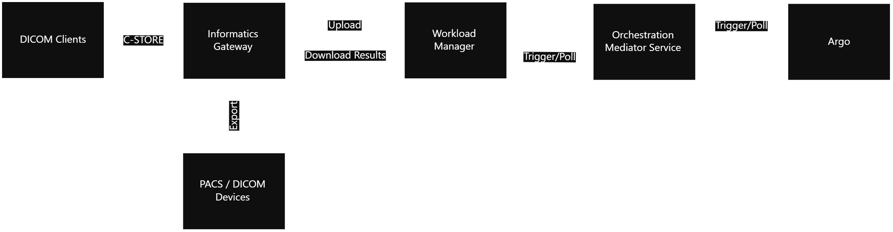

# MONAI Deploy Workload Manager v0.1.0 Design & Scope

This document outlines the design decisions and scopes for version 0.1.0 of the MONAI Deploy Workload Manager.

## Assumptions & Constraints

- In this release, Argo is used as the workflow orchestration engine. However, MWM is designed to have a pluggable architecture to support other orchestration engines in the future.

- This release supports MAP specification 1.0, a single docker container built using the MONAI Deploy App Packager.

- The ADS (App Discovery Service) and related sub-components may be optional if there are time constraints.  The workaround is to rely on AE-TITLE-to-Application mapping, which requires the user to configure an AET per application and have Informatics Gateway (IG) pass in the application information.

## Designs & Diagrams


### Deploy & Setup

The following sequence diagram depicts how users deploy a workflow (with a single MAP).


To simplify application registration workflow, the CLI has to communicate with both the Workload Manager as well as Informatics Gateway and perform the following actions:

1. Deploy workflow to the App Registration API
   1. Upload Argo workflow
   2. Validate the Argo workflow
   3. Return the Application ID
2. Register the configured sink with the Application ID from step 1
   1. Validate the sink configuration
   2. Save sink
3. Create Informatics Gateway AE Title with the Application ID from step 1

#### Workflow Registration Definition

```json
{
  "monaid": {
    "applicationName": "my-app",
    "version": "1.0.0-beta",
    "description": "my awesome app",
    "appDiscovery": {
      "grouping": "0020,000E",
      "timeout": 5
    },
    "sinks": [
      {
        "agent": "MONAISCU",
        "arguments": "PACS-WEST"
      },
      {
        "agent": "MONAISCU",
        "arguments": "Dr Watson's Workstation"
      }
    ],
    "inputSources": [
      {
        "name": "PACS-EAST",
        "aeTitle": "PACS-EAST",
        "hostIp": "10.20.30.40"
      },
      {
        "name": "PACS-WEST",
        "aeTitle": "PACS-WEST",
        "hostIp": "10.20.50.100"
      }
    ],
    "outputDestinations": [
      {
        "name": "PACS-WEST",
        "aeTitle": "PACS-WEST",
        "hostIp": "10.20.50.100",
        "port": 104
      },
      {
        "name": "Dr Watson's Workstation",
        "aeTitle": "DRWATSONWS",
        "hostIp": "10.220.12.150",
        "port": 104
      }
    ]
  }
}
```

#### Scope


##### Overall
- Define MONAI Deploay Workload Manager workflow definition
  - Output sink(s)
  - AE Title

##### CLI

A single CLI that interacts with both Workload Manager & OES and possible IG:
- register argo workflow with OMS
- map application to export sinks
- map AE title to the applications (requires IG API)

##### Workload Manager

- Export API
  - Sink.Create API

##### Orchestration Mediator Service (OMS)

- App Registration API: provides APIs to register applications
    - validate & register workflow API
- Orchestration Mediator API
    - validate workflow
- Argo plugin
    - validate workflow (if needed) may be a no-op


### Trigger Workflow



The following sequence diagram depicts how 2 DICOM studies are processed through WM with grouping by StudyInstanceUID.


#### Scope

##### Workload Manager

- File API: provides functionalities to upload files via gRPC
    - File.Upload API for file uploads
- App Discovery Service: service that associates incoming datasets to one or more matching applications
    - eventing system to receive file arrival notices
    - creates buckets to store files
- Job Service
    - Data bucket management for storing matching files and composing inference jobs
- Result Collection service: collects application generated results
    - implement interface and abstract class
    - Poll job status
    - Downloads results from orchestration mediator service
    - DICOM sink
- Orchestration Mediator Service
    - launches workflow/job
    - queries workflow/job status
- Argo plugin
    - launches workflow/job
    - queries workflow/job status
- Database
    - schema
- Deployment
    - Helm chart


### Data Export

The following sequence diagram explains how Export Clients (in this release, IG) queries for the available export tasks and exports to external DICOM entities.


#### Scope

- Export API: provides APIs to query/update export tasks for the specified export sink
  - Query Tasks
  - Update Tasks
- File API: provides functionalities to download a file (result)
  - File.Download


### Testing

#### Unit Test

- Unit test shall be included where possible
- Verification test with BDD style testing
- Integration Test with IG & Argo if time permits
