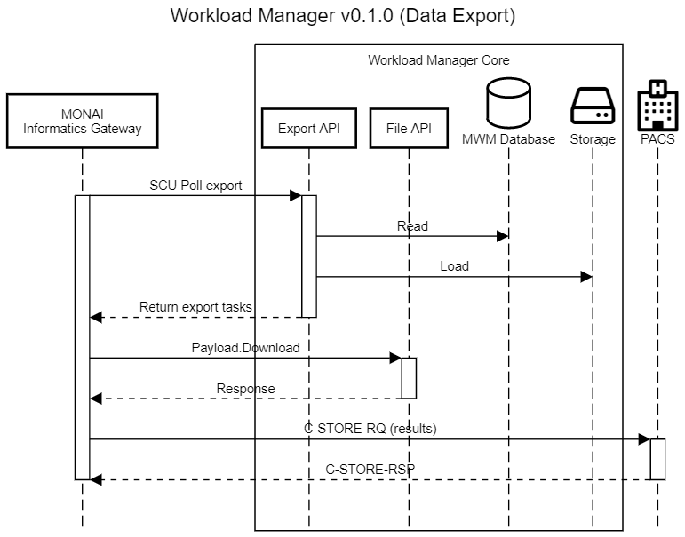

# MONAI Deploy Workload Manager v0.1.0 Design & Scope

This document outlines the design decisions and scopes for version 0.1.0.

## Assumptions & Constraints

- In this release, Argo is used as the workflow orchestration engine. However, MWM is designed to have a pluggable architecture to support other orchestration engines in the future.

- This release supports MAP specification 1.0, a single docker container built using the MONAI Deploy App Packager.

- The DDS (Data Discovery Service) and related sub-components may be optional if there are time constraints.  The workaround is to rely on AE-TITLE-to-Application mapping which requires the user to configure an AET per application and have Informatics Gateway (IG) pass in the application information.

## Designs & Diagrams

### Deploy & Setup

The following sequence diagram depicts how users deploy a workflow (with a single MAP).

#### Scope

##### Overall
- Define MONAI Deploay Workload Manager workflow definition
  - Output sink(s)
  - AE Title

##### CLI

A single CLI that interacts with both Workload Manager & OES and possible IG:
- register argo workflow with OES
- map application to export sinks
- map AE title to application (requires IG API)

##### Workload Manager

- Export API
  - Sink.Create API

##### Orchestration Mediator Service (OMS)

- Apps API
    - validate & register workflow API
- Orchestration Engine Plugin Interface
    - validate workflow
- Argo plugin
    - validate workflow (if needed) may be a no-op

### Trigger Workflow

The following sequence diagram depicts how 2 DICOM studies are processed through WM with grouping by StudyInstanceUID.

#### Scope

- Payloads API
    - Payload.Upload API for file uploads
- Data Discovery Engine
    - eventing system to receive payload arrival notices
    - creates buckets to store files
- Job Scheduling Service
    - Data bucket management for storing matching files, timer management, job scheduling (simply save to DB)
- Orchestration Engine Plugin Interface
    - launches workflow/job
    - queries workflow/job status
- Argo plugin
    - launches workflow/job
    - queries workflow/job status
- Data export plugin service
    - implement interface and abstract class
    - DICOM sink
- Database
    - schema
- Deployment
    - Helm chart

### Data Export

The following sequence diagram explains how Export Clients (in this release, IG) queries for the available export tasks and exports to external DICOM entities.

#### Scope

- Export API
  - Query Tasks
  - Update Tasks
- Payload API
  - Payload.Download

### Testing

#### Unit Test

- Unit test shall be included where possible
- Verification test with BDD style testing
- Integration Test with IG & Argo if time permits
