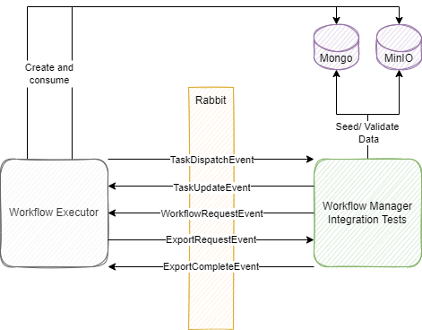
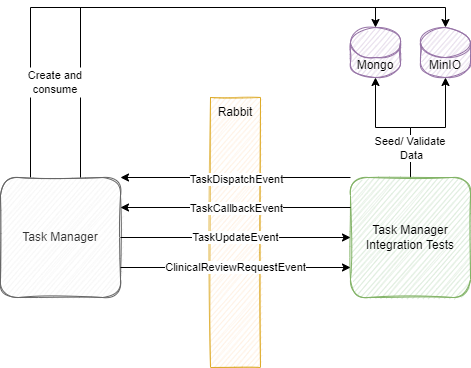

<!--
  ~ Copyright 2022 MONAI Consortium
  ~
  ~ Licensed under the Apache License, Version 2.0 (the "License");
  ~ you may not use this file except in compliance with the License.
  ~ You may obtain a copy of the License at
  ~
  ~ http://www.apache.org/licenses/LICENSE-2.0
  ~
  ~ Unless required by applicable law or agreed to in writing, software
  ~ distributed under the License is distributed on an "AS IS" BASIS,
  ~ WITHOUT WARRANTIES OR CONDITIONS OF ANY KIND, either express or implied.
  ~ See the License for the specific language governing permissions and
  ~ limitations under the License.
-->

## Overview
Backend integration tests are designed to functionally test Workflow Manager components (Workflow Executor and Task Manager) in isolation from each other.

- Where possible dockerized external dependencies have been used and given state by the integration tests (MongoDB/RabbitMQ/MinIO) using seeding and clean up scripts.
- docker-compose file can be used to create the external dependencies. Please see 
- Pipeline execution uses GitHub services to create external dependencies. Please see 

## Purpose

This document describes the architecture, how the tests have been written and how to run the tests.

## Tools
- .Net 6 SDK (https://dotnet.microsoft.com/en-us/download/dotnet/6.0)
- Docker Desktop (https://docs.docker.com/desktop/)
- Visual Studio LTS (https://docs.microsoft.com/en-us/visualstudio/install/install-visual-studio?view=vs-2022)
- Specflow BDD (https://docs.specflow.org/projects/specflow/en/latest/visualstudio/visual-studio-installation.html)
- Nunit

## Workflow Executor
### Overview
The Workflow Executor integration tests replicate the behavior of external components (TaskManager and MONAI Informatics gateway) and seed Mongo and MinIO to give state. By replicating external components the tests are robust, repeatable and can assert, given the set up state, that Rabbit events and Mongo data is correct for that scenario.

- Replicate MIG behavior by publishing WorkflowRequestEvents and ExportCompleteEvents as well as  consuming ExportRequestEvents
- Replicate TaskManager behavior by publishing TaskUpdateEvents and consuming TaskDispatchEvents
- Seed Mongo with WorkflowRevisions and WorkflowInstances and seed MinIO with Study and Metadata to give state

### Architecture

### Test Flow Examples
#### WorkflowRequestEvent Integration Test
**Arrange**
- WorkflowExecutor Running
- Seed MongoDB with WorkflowRevision

**Act**
- Seed MinIO with Study and Patient Metadata
- Publish WorkflowRequestEvent matching AETitle of WorkflowRevision

**Assert**
- TaskDispatchEvent published with details of Task 1 from WorkflowRevision
- WorkflowInstance created in MongoDB with correct details

#### TaskUpdateEvent Integration Test
**Arrange**
- Workflow Executor Running
- Seed MongoDB with WorkflowRevision
- Seed MongoDB with WorkflowInstance with Task in a “Dispatched” status

**Act**
- Seed MinIO with output from Task
- Publish TaskUpdateEvent

**Assert**
- WorkflowInstance updated by TaskUpdateEvent in MongoDB
- TaskDispatchEvent published with details of next Task based on TaskDestination

## Task Manager
### Overview
The Task Manager integration tests replicate the behavior of external components (Workflow Executor and Plugins) and check that the Task Manager responds correctly to Task Requests.

- Replicate Workflow Executor behavior by publishing TaskDispatchEvents and consuming TaskUpdateEvents
- Replicate Plugin behavior by publishing TaskCallbackEvents and consuming ClinicalReviewRequests.

### Architecture

### Test Flow Examples
#### TaskDispatchEvent Integration Test

**Arrange**
- Task Manager Running

**Act**
- Publish TaskDispatchEvent

**Assert**
- TaskUpdateEvent published with details that the Task has been accepted by the plugin
- TaskDispatchEvent saved in MongoDB with correct details

#### TaskCallbackEvent Integration Test

**Arrange**
- Task Manager Running

**Act**
- Publish TaskCallbackEvent

**Assert**
- TaskUpdateEvent published with details of the TaskCallbackEvent

#### ClinicalReviewRequestEvent Integration Test

**Arrange**
- Task Manager Running

**Act**
- Publish TaskDispatchEvent for Clinical Review Plugin

**Assert**
- ClinicalReviewRequestEvent published with correct details